# California house prices

This is the dataset used in the second chapter of Aurélien Géron's recent book 'Hands-On Machine learning with Scikit-Learn and TensorFlow'. It serves as an excellent introduction to implementing machine learning algorithms because it requires rudimentary data cleaning, has an easily understandable list of variables and sits at an optimal size between being to toyish and too cumbersome.

The data contains information from the 1990 California census.

This notebook uses Pipelines for data processing and regressor training. This is specially useful for avoiding data leaks when doing crossvalidation and model selection via GridSearch.


```python
# Some notebook settings
import matplotlib.pyplot as plt
%matplotlib inline
%config InlineBackend.figure_format = 'svg'
```

## Initial data exploration


```python
import pandas as pd
HOUSES_CSV_PATH = ('/home/diego/Documents/Books/Hands_on_Machine_Learning_with_Scikit_Learn/'
                   'handson-ml/datasets/housing/housing.csv')
housing = pd.read_csv(HOUSES_CSV_PATH)
print('Shape: ', housing.shape)
target = 'median_house_value'
print('Target: ', target)


housing.head(10)
```

    Shape:  (20640, 10)
    Target:  median_house_value


<div>
<style scoped>
    .dataframe tbody tr th:only-of-type {
        vertical-align: middle;
    }

    .dataframe tbody tr th {
        vertical-align: top;
    }

    .dataframe thead th {
        text-align: right;
    }
</style>
<table border="1" class="dataframe">
  <thead>
    <tr style="text-align: right;">
      <th></th>
      <th>longitude</th>
      <th>latitude</th>
      <th>housing_median_age</th>
      <th>total_rooms</th>
      <th>total_bedrooms</th>
      <th>population</th>
      <th>households</th>
      <th>median_income</th>
      <th>median_house_value</th>
      <th>ocean_proximity</th>
    </tr>
  </thead>
  <tbody>
    <tr>
      <th>0</th>
      <td>-122.23</td>
      <td>37.88</td>
      <td>41.0</td>
      <td>880.0</td>
      <td>129.0</td>
      <td>322.0</td>
      <td>126.0</td>
      <td>8.3252</td>
      <td>452600.0</td>
      <td>NEAR BAY</td>
    </tr>
    <tr>
      <th>1</th>
      <td>-122.22</td>
      <td>37.86</td>
      <td>21.0</td>
      <td>7099.0</td>
      <td>1106.0</td>
      <td>2401.0</td>
      <td>1138.0</td>
      <td>8.3014</td>
      <td>358500.0</td>
      <td>NEAR BAY</td>
    </tr>
    <tr>
      <th>2</th>
      <td>-122.24</td>
      <td>37.85</td>
      <td>52.0</td>
      <td>1467.0</td>
      <td>190.0</td>
      <td>496.0</td>
      <td>177.0</td>
      <td>7.2574</td>
      <td>352100.0</td>
      <td>NEAR BAY</td>
    </tr>
    <tr>
      <th>3</th>
      <td>-122.25</td>
      <td>37.85</td>
      <td>52.0</td>
      <td>1274.0</td>
      <td>235.0</td>
      <td>558.0</td>
      <td>219.0</td>
      <td>5.6431</td>
      <td>341300.0</td>
      <td>NEAR BAY</td>
    </tr>
    <tr>
      <th>4</th>
      <td>-122.25</td>
      <td>37.85</td>
      <td>52.0</td>
      <td>1627.0</td>
      <td>280.0</td>
      <td>565.0</td>
      <td>259.0</td>
      <td>3.8462</td>
      <td>342200.0</td>
      <td>NEAR BAY</td>
    </tr>
    <tr>
      <th>5</th>
      <td>-122.25</td>
      <td>37.85</td>
      <td>52.0</td>
      <td>919.0</td>
      <td>213.0</td>
      <td>413.0</td>
      <td>193.0</td>
      <td>4.0368</td>
      <td>269700.0</td>
      <td>NEAR BAY</td>
    </tr>
    <tr>
      <th>6</th>
      <td>-122.25</td>
      <td>37.84</td>
      <td>52.0</td>
      <td>2535.0</td>
      <td>489.0</td>
      <td>1094.0</td>
      <td>514.0</td>
      <td>3.6591</td>
      <td>299200.0</td>
      <td>NEAR BAY</td>
    </tr>
    <tr>
      <th>7</th>
      <td>-122.25</td>
      <td>37.84</td>
      <td>52.0</td>
      <td>3104.0</td>
      <td>687.0</td>
      <td>1157.0</td>
      <td>647.0</td>
      <td>3.1200</td>
      <td>241400.0</td>
      <td>NEAR BAY</td>
    </tr>
    <tr>
      <th>8</th>
      <td>-122.26</td>
      <td>37.84</td>
      <td>42.0</td>
      <td>2555.0</td>
      <td>665.0</td>
      <td>1206.0</td>
      <td>595.0</td>
      <td>2.0804</td>
      <td>226700.0</td>
      <td>NEAR BAY</td>
    </tr>
    <tr>
      <th>9</th>
      <td>-122.25</td>
      <td>37.84</td>
      <td>52.0</td>
      <td>3549.0</td>
      <td>707.0</td>
      <td>1551.0</td>
      <td>714.0</td>
      <td>3.6912</td>
      <td>261100.0</td>
      <td>NEAR BAY</td>
    </tr>
  </tbody>
</table>
</div>


Are there any missing values?


```python
housing.isnull().sum()
```


    longitude               0
    latitude                0
    housing_median_age      0
    total_rooms             0
    total_bedrooms        207
    population              0
    households              0
    median_income           0
    median_house_value      0
    ocean_proximity         0
    dtype: int64


Histogram of the target variable:


```python
import seaborn as sns
from scipy.stats import skew, kurtosis

print('Skewness: ', skew(housing[target]))
print('Kurtosis: ', kurtosis(housing[target]))
sns.distplot(housing[target])
```

    Skewness:  0.9776922140978416
    Kurtosis:  0.3275001388119616


    <matplotlib.axes._subplots.AxesSubplot at 0x7fb8e70d5e10>


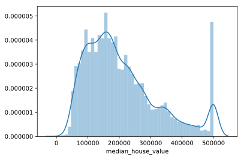


It seems there is a problem with data: there are a lot of observations censored at 500.000.

Creating a pair_plot of the most correlated variables with respect to the target to further inspect the problem:


```python
from PairPlot import pair_plot, joint_plot  # custom-made pairs plot library

pair_plot(housing, sample=1000, target='median_house_value', num_cols=8)
```


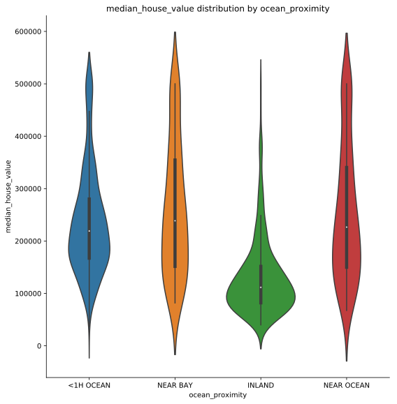


Finding how many observations present the censoring problem:


```python
housing[target].value_counts().head(5)
```


    500001.0    965
    137500.0    122
    162500.0    117
    112500.0    103
    187500.0     93
    Name: median_house_value, dtype: int64


```python
965/len(housing) * 100
```


    4.675387596899225


~4.68% of data is censored. By now, the corresponding records will be discarded in the totality of the data set.


```python
housing = housing.loc[housing[target] <= 500_000].copy()

print('Shape: ', housing.shape)
print('Skewness: ', skew(housing[target]))
print('Kurtosis: ', kurtosis(housing[target]))
sns.distplot(housing[target])
plt.savefig('images/Dist1.svg')
```

    Shape:  (19675, 10)
    Skewness:  0.8095099388023556
    Kurtosis:  0.162607995059743


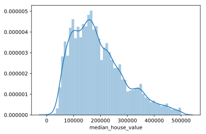


```python
pair_plot(housing, sample=1000, target='median_house_value', num_cols=8)
```


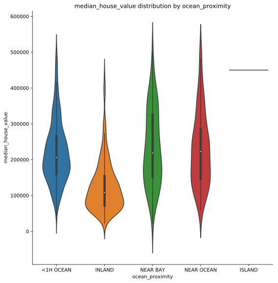


## Stratified train-test split

To reduce sampling bias, it is desirable to make a stratified sample of train-test.

As median income is the most important feature in the dataset, it will be used for the stratified split


```python
import numpy as np
from sklearn.model_selection import train_test_split, StratifiedShuffleSplit


def stratified_split(df, col, test_size):
    split = StratifiedShuffleSplit(n_splits=1, test_size=test_size, random_state=42)
    for train_index, test_index in split.split(df, df[col]):
        strat_train = df.iloc[train_index]
        strat_test = df.iloc[test_index]
    return strat_train, strat_test


def split_and_compare(housing_in, col, test_size):
    housing = housing_in.copy()
    housing['col_strat'] = pd.cut(housing[col], bins=[0., 1.5, 3.0, 4.5, 6., np.inf],
                                   labels=[1, 2, 3, 4, 5])

    def income_cat_proportions(df, col):
        return df[col].value_counts() / len(df)

    # Compare the two train-test splits:
    train, test = train_test_split(housing, test_size=test_size, random_state=42)
    strat_train, strat_test = stratified_split(housing, 'col_strat', test_size)
    compare_props = pd.DataFrame({"income_cat": housing['col_strat'].value_counts().index,
                                  "Overall": income_cat_proportions(housing, 'col_strat'),
                                  "Random": income_cat_proportions(test, 'col_strat'),
                                 "Stratified": income_cat_proportions(strat_test, 'col_strat')}
                                 ).sort_index()
    compare_props["Rand. %error"] = 100 * compare_props["Random"] / compare_props["Overall"] - 100
    compare_props["Strat. %error"] = 100 * compare_props["Stratified"] / compare_props["Overall"] - 100
    print('Bias error comparison, normal split vs. stratified split:\n', compare_props)
    del housing['col_strat'], strat_train['col_strat'], strat_test['col_strat']
    del train['col_strat'], test['col_strat']
    return strat_train, strat_test


train_raw, test_raw = split_and_compare(housing, col="median_income", test_size=0.2)
print('\nTrain shape: ', train_raw.shape, '\nTest shape: ', test_raw.shape)
```

    Bias error comparison, normal split vs. stratified split:
       income_cat   Overall    Random  Stratified  Rand. %error  Strat. %error
    1          1  0.041372  0.041931    0.041423      1.351351       0.122850
    2          2  0.333011  0.328590    0.332910     -1.327839      -0.030525
    3          3  0.361017  0.353494    0.361118     -2.083627       0.028157
    4          4  0.177992  0.183227    0.177891      2.941176      -0.057110
    5          5  0.086607  0.092757    0.086658      7.100939       0.058685
    
    Train shape:  (15740, 10) 
    Test shape:  (3935, 10)


```python
X_train_raw = train_raw.drop(target, axis=1)
X_test_raw = test_raw.drop(target, axis=1)

y_train_raw = train_raw[[target]]
y_test_raw = test_raw[[target]]
```

## Transforming the target variable: y pipeline definition


```python
from sklearn.pipeline import Pipeline
from sklearn.preprocessing import PowerTransformer
from scipy.stats import norm

# Using DataFrameMapper instead of Pipes because it can return a DataFrame
y_pipe = Pipeline(steps=[
    ('transform', PowerTransformer(method='box-cox', standardize=True))
])

y_train = y_pipe.fit_transform(y_train_raw)
y_test = y_pipe.transform(y_test_raw)   
# when transorming the test target only transform is used (transformer is fitted on train data)

sns.distplot(y_train, fit=norm)
print('Skewness: ', skew(y_train))
print('Kurtosis: ', kurtosis(y_train))
```

    Skewness:  [-0.02249037]
    Kurtosis:  [-0.57151653]


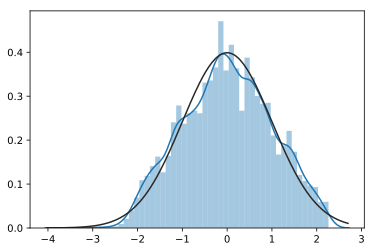


## Feature engineering


```python
# Select columns by numeric or categorical type
num_cols = X_train_raw.select_dtypes(['number']).columns
cat_cols = X_train_raw.select_dtypes(exclude=['number']).columns
print(f'Numeric features: {", ".join(num_cols)}')
print(f'\nCategorical features: {", ".join(cat_cols)}')
```

    Numeric features: longitude, latitude, housing_median_age, total_rooms, total_bedrooms, population, households, median_income
    
    Categorical features: ocean_proximity


```python
from PairPlot import hist_plots

hist_plots(train_raw)
```


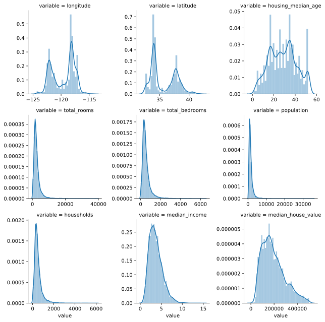


The features latitude and longitude present a bimodal distribution, and can be transformed using the QuantileTransformer from Sklearn:


```python
from sklearn.preprocessing import QuantileTransformer  # might use RobustScaler as well

trans = QuantileTransformer(output_distribution='normal')
long = X_train_raw['longitude'].values
long
```


    array([-122.26, -122.32, -118.26, ..., -118.5 , -117.91, -121.63])


```python
long = trans.fit_transform(long.reshape(-1, 1))
long
```


    array([[-1.22328725],
           [-1.34949764],
           [ 0.29660674],
           ...,
           [ 0.00627288],
           [ 0.79532164],
           [-0.63638652]])


```python
sns.distplot(long.flat, fit=norm)
plt.title('Longitude transformed')
print('Skewness: ', skew(long.flat))
print('Kurtosis: ', kurtosis(long.flat))
```

    Skewness:  -0.0026342142974853
    Kurtosis:  0.022214862523137757


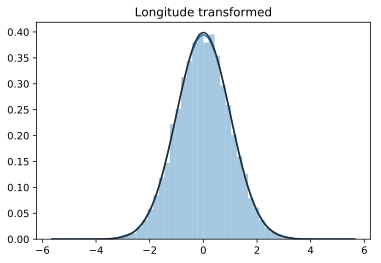


Wrapping the transformer in a pipeline using DataFrameMapper: (columns: latitude and longitude)


```python
from sklearn_pandas import DataFrameMapper

quantile_mapper = DataFrameMapper([
    (['latitude'], QuantileTransformer(output_distribution='normal')),
    (['longitude'], QuantileTransformer(output_distribution='normal'))
], df_out=True, default=None)  # Default=None: passthrough of the other columns
```


```python
# test of the quantile transformer:
quantile_mapper.fit_transform(X_train_raw)
```


<div>
<style scoped>
    .dataframe tbody tr th:only-of-type {
        vertical-align: middle;
    }

    .dataframe tbody tr th {
        vertical-align: top;
    }

    .dataframe thead th {
        text-align: right;
    }
</style>
<table border="1" class="dataframe">
  <thead>
    <tr style="text-align: right;">
      <th></th>
      <th>latitude</th>
      <th>longitude</th>
      <th>housing_median_age</th>
      <th>total_rooms</th>
      <th>total_bedrooms</th>
      <th>population</th>
      <th>households</th>
      <th>median_income</th>
      <th>ocean_proximity</th>
    </tr>
  </thead>
  <tbody>
    <tr>
      <th>38</th>
      <td>0.839121</td>
      <td>-1.223287</td>
      <td>52</td>
      <td>1470</td>
      <td>330</td>
      <td>689</td>
      <td>309</td>
      <td>3.48</td>
      <td>NEAR BAY</td>
    </tr>
    <tr>
      <th>18744</th>
      <td>2.225823</td>
      <td>-1.349498</td>
      <td>15</td>
      <td>2524</td>
      <td>449</td>
      <td>1374</td>
      <td>467</td>
      <td>3.3816</td>
      <td>INLAND</td>
    </tr>
    <tr>
      <th>4905</th>
      <td>-0.493553</td>
      <td>0.296607</td>
      <td>47</td>
      <td>1269</td>
      <td>323</td>
      <td>1628</td>
      <td>325</td>
      <td>1.5089</td>
      <td>&lt;1H OCEAN</td>
    </tr>
    <tr>
      <th>11193</th>
      <td>-0.899534</td>
      <td>0.781626</td>
      <td>38</td>
      <td>1316</td>
      <td>263</td>
      <td>671</td>
      <td>278</td>
      <td>3.2969</td>
      <td>&lt;1H OCEAN</td>
    </tr>
    <tr>
      <th>19601</th>
      <td>0.543789</td>
      <td>-0.384375</td>
      <td>27</td>
      <td>925</td>
      <td>176</td>
      <td>449</td>
      <td>168</td>
      <td>2.6406</td>
      <td>INLAND</td>
    </tr>
    <tr>
      <th>20256</th>
      <td>-0.061513</td>
      <td>-0.104318</td>
      <td>33</td>
      <td>1039</td>
      <td>256</td>
      <td>1432</td>
      <td>272</td>
      <td>3.1103</td>
      <td>NEAR OCEAN</td>
    </tr>
    <tr>
      <th>16650</th>
      <td>0.116719</td>
      <td>-0.326900</td>
      <td>23</td>
      <td>1630</td>
      <td>253</td>
      <td>704</td>
      <td>263</td>
      <td>5.156</td>
      <td>NEAR OCEAN</td>
    </tr>
    <tr>
      <th>1373</th>
      <td>1.018778</td>
      <td>-1.033647</td>
      <td>20</td>
      <td>6992</td>
      <td>1404</td>
      <td>3221</td>
      <td>1334</td>
      <td>4.2042</td>
      <td>NEAR BAY</td>
    </tr>
    <tr>
      <th>9635</th>
      <td>0.342823</td>
      <td>-0.400635</td>
      <td>17</td>
      <td>1118</td>
      <td>270</td>
      <td>560</td>
      <td>244</td>
      <td>2.0216</td>
      <td>INLAND</td>
    </tr>
    <tr>
      <th>13294</th>
      <td>-0.304482</td>
      <td>1.020888</td>
      <td>37</td>
      <td>2576</td>
      <td>468</td>
      <td>1284</td>
      <td>428</td>
      <td>3.3958</td>
      <td>INLAND</td>
    </tr>
    <tr>
      <th>11361</th>
      <td>-1.128144</td>
      <td>0.781626</td>
      <td>24</td>
      <td>5321</td>
      <td>1063</td>
      <td>4011</td>
      <td>1047</td>
      <td>4.3882</td>
      <td>&lt;1H OCEAN</td>
    </tr>
    <tr>
      <th>16538</th>
      <td>0.809168</td>
      <td>-0.440383</td>
      <td>13</td>
      <td>335</td>
      <td>89</td>
      <td>247</td>
      <td>77</td>
      <td>1.6111</td>
      <td>INLAND</td>
    </tr>
    <tr>
      <th>15196</th>
      <td>-1.554270</td>
      <td>1.571286</td>
      <td>9</td>
      <td>2012</td>
      <td>316</td>
      <td>802</td>
      <td>289</td>
      <td>6.5706</td>
      <td>&lt;1H OCEAN</td>
    </tr>
    <tr>
      <th>13987</th>
      <td>0.090819</td>
      <td>1.456896</td>
      <td>21</td>
      <td>3254</td>
      <td>669</td>
      <td>1548</td>
      <td>545</td>
      <td>2.3373</td>
      <td>INLAND</td>
    </tr>
    <tr>
      <th>14635</th>
      <td>-1.694923</td>
      <td>1.321946</td>
      <td>34</td>
      <td>1398</td>
      <td>222</td>
      <td>532</td>
      <td>244</td>
      <td>3.7102</td>
      <td>NEAR OCEAN</td>
    </tr>
    <tr>
      <th>16664</th>
      <td>0.114415</td>
      <td>-0.338834</td>
      <td>20</td>
      <td>1248</td>
      <td>231</td>
      <td>722</td>
      <td>225</td>
      <td>4.625</td>
      <td>NEAR OCEAN</td>
    </tr>
    <tr>
      <th>12956</th>
      <td>1.494155</td>
      <td>-0.487893</td>
      <td>21</td>
      <td>6575</td>
      <td>1105</td>
      <td>3358</td>
      <td>1098</td>
      <td>4.0739</td>
      <td>INLAND</td>
    </tr>
    <tr>
      <th>10553</th>
      <td>-1.272478</td>
      <td>0.957454</td>
      <td>14</td>
      <td>2945</td>
      <td>356</td>
      <td>1293</td>
      <td>335</td>
      <td>8.111</td>
      <td>&lt;1H OCEAN</td>
    </tr>
    <tr>
      <th>9089</th>
      <td>0.076604</td>
      <td>0.349483</td>
      <td>25</td>
      <td>2627</td>
      <td>387</td>
      <td>1059</td>
      <td>338</td>
      <td>3.6382</td>
      <td>INLAND</td>
    </tr>
    <tr>
      <th>20487</th>
      <td>0.016310</td>
      <td>-0.029863</td>
      <td>5</td>
      <td>6123</td>
      <td>825</td>
      <td>2440</td>
      <td>736</td>
      <td>7.9013</td>
      <td>&lt;1H OCEAN</td>
    </tr>
    <tr>
      <th>19749</th>
      <td>2.075198</td>
      <td>-1.179402</td>
      <td>39</td>
      <td>2191</td>
      <td>493</td>
      <td>1307</td>
      <td>499</td>
      <td>1.6483</td>
      <td>INLAND</td>
    </tr>
    <tr>
      <th>10782</th>
      <td>-1.272478</td>
      <td>0.795322</td>
      <td>29</td>
      <td>1652</td>
      <td>310</td>
      <td>832</td>
      <td>326</td>
      <td>4.8098</td>
      <td>&lt;1H OCEAN</td>
    </tr>
    <tr>
      <th>12691</th>
      <td>1.343287</td>
      <td>-0.540882</td>
      <td>33</td>
      <td>2648</td>
      <td>357</td>
      <td>863</td>
      <td>359</td>
      <td>8.4016</td>
      <td>INLAND</td>
    </tr>
    <tr>
      <th>4839</th>
      <td>-0.441766</td>
      <td>0.248427</td>
      <td>42</td>
      <td>907</td>
      <td>378</td>
      <td>822</td>
      <td>288</td>
      <td>1.2875</td>
      <td>&lt;1H OCEAN</td>
    </tr>
    <tr>
      <th>2867</th>
      <td>0.135911</td>
      <td>-0.050623</td>
      <td>34</td>
      <td>2412</td>
      <td>446</td>
      <td>1558</td>
      <td>421</td>
      <td>2.6903</td>
      <td>INLAND</td>
    </tr>
    <tr>
      <th>10064</th>
      <td>1.837371</td>
      <td>-0.403356</td>
      <td>15</td>
      <td>1337</td>
      <td>326</td>
      <td>1172</td>
      <td>306</td>
      <td>2.6341</td>
      <td>INLAND</td>
    </tr>
    <tr>
      <th>4825</th>
      <td>-0.415634</td>
      <td>0.209787</td>
      <td>29</td>
      <td>2038</td>
      <td>578</td>
      <td>2070</td>
      <td>570</td>
      <td>2.0658</td>
      <td>&lt;1H OCEAN</td>
    </tr>
    <tr>
      <th>16181</th>
      <td>0.941700</td>
      <td>-0.472407</td>
      <td>46</td>
      <td>1026</td>
      <td>330</td>
      <td>1109</td>
      <td>333</td>
      <td>1.2904</td>
      <td>INLAND</td>
    </tr>
    <tr>
      <th>5739</th>
      <td>-0.142244</td>
      <td>0.336178</td>
      <td>52</td>
      <td>1904</td>
      <td>297</td>
      <td>797</td>
      <td>286</td>
      <td>6.6603</td>
      <td>&lt;1H OCEAN</td>
    </tr>
    <tr>
      <th>11834</th>
      <td>1.758012</td>
      <td>-0.273003</td>
      <td>22</td>
      <td>8259</td>
      <td>1409</td>
      <td>845</td>
      <td>353</td>
      <td>3.3699</td>
      <td>INLAND</td>
    </tr>
    <tr>
      <th>...</th>
      <td>...</td>
      <td>...</td>
      <td>...</td>
      <td>...</td>
      <td>...</td>
      <td>...</td>
      <td>...</td>
      <td>...</td>
      <td>...</td>
    </tr>
    <tr>
      <th>16990</th>
      <td>0.533636</td>
      <td>-1.247505</td>
      <td>15</td>
      <td>1958</td>
      <td>282</td>
      <td>811</td>
      <td>284</td>
      <td>8.1221</td>
      <td>NEAR BAY</td>
    </tr>
    <tr>
      <th>14612</th>
      <td>-1.738731</td>
      <td>1.368450</td>
      <td>30</td>
      <td>5201</td>
      <td>1104</td>
      <td>2961</td>
      <td>1064</td>
      <td>3.2661</td>
      <td>NEAR OCEAN</td>
    </tr>
    <tr>
      <th>14942</th>
      <td>-1.976943</td>
      <td>1.873053</td>
      <td>17</td>
      <td>3101</td>
      <td>547</td>
      <td>1410</td>
      <td>486</td>
      <td>3.1771</td>
      <td>&lt;1H OCEAN</td>
    </tr>
    <tr>
      <th>2014</th>
      <td>0.253606</td>
      <td>-0.218773</td>
      <td>19</td>
      <td>1719</td>
      <td>391</td>
      <td>1369</td>
      <td>368</td>
      <td>1.25</td>
      <td>INLAND</td>
    </tr>
    <tr>
      <th>9151</th>
      <td>0.047692</td>
      <td>-0.003764</td>
      <td>19</td>
      <td>3013</td>
      <td>507</td>
      <td>1356</td>
      <td>484</td>
      <td>5.1163</td>
      <td>&lt;1H OCEAN</td>
    </tr>
    <tr>
      <th>12884</th>
      <td>1.442543</td>
      <td>-0.514923</td>
      <td>16</td>
      <td>3154</td>
      <td>860</td>
      <td>1837</td>
      <td>793</td>
      <td>1.9805</td>
      <td>INLAND</td>
    </tr>
    <tr>
      <th>749</th>
      <td>0.621099</td>
      <td>-0.953493</td>
      <td>32</td>
      <td>2015</td>
      <td>318</td>
      <td>1019</td>
      <td>340</td>
      <td>6.1104</td>
      <td>NEAR BAY</td>
    </tr>
    <tr>
      <th>11559</th>
      <td>-1.086456</td>
      <td>0.699108</td>
      <td>28</td>
      <td>3215</td>
      <td>652</td>
      <td>2066</td>
      <td>636</td>
      <td>4.0194</td>
      <td>&lt;1H OCEAN</td>
    </tr>
    <tr>
      <th>3296</th>
      <td>1.631573</td>
      <td>-1.942703</td>
      <td>27</td>
      <td>2300</td>
      <td>508</td>
      <td>526</td>
      <td>254</td>
      <td>2.1838</td>
      <td>INLAND</td>
    </tr>
    <tr>
      <th>7553</th>
      <td>-0.736442</td>
      <td>0.425228</td>
      <td>36</td>
      <td>1138</td>
      <td>238</td>
      <td>878</td>
      <td>224</td>
      <td>2.0625</td>
      <td>&lt;1H OCEAN</td>
    </tr>
    <tr>
      <th>19939</th>
      <td>0.193143</td>
      <td>-0.137177</td>
      <td>14</td>
      <td>1680</td>
      <td>343</td>
      <td>931</td>
      <td>350</td>
      <td>2.7336</td>
      <td>INLAND</td>
    </tr>
    <tr>
      <th>14900</th>
      <td>-2.651732</td>
      <td>1.649237</td>
      <td>10</td>
      <td>1686</td>
      <td>414</td>
      <td>1000</td>
      <td>391</td>
      <td>2.1765</td>
      <td>NEAR OCEAN</td>
    </tr>
    <tr>
      <th>2355</th>
      <td>0.271787</td>
      <td>-0.177827</td>
      <td>21</td>
      <td>1260</td>
      <td>182</td>
      <td>583</td>
      <td>205</td>
      <td>6.0132</td>
      <td>INLAND</td>
    </tr>
    <tr>
      <th>8904</th>
      <td>-0.415634</td>
      <td>0.021329</td>
      <td>32</td>
      <td>2909</td>
      <td>748</td>
      <td>1310</td>
      <td>706</td>
      <td>4.516</td>
      <td>&lt;1H OCEAN</td>
    </tr>
    <tr>
      <th>5949</th>
      <td>-0.179102</td>
      <td>0.866189</td>
      <td>36</td>
      <td>3097</td>
      <td>667</td>
      <td>1484</td>
      <td>634</td>
      <td>3.1905</td>
      <td>INLAND</td>
    </tr>
    <tr>
      <th>3126</th>
      <td>0.112310</td>
      <td>0.914679</td>
      <td>4</td>
      <td>2</td>
      <td>2</td>
      <td>6</td>
      <td>2</td>
      <td>2.375</td>
      <td>INLAND</td>
    </tr>
    <tr>
      <th>19391</th>
      <td>0.773140</td>
      <td>-0.360172</td>
      <td>25</td>
      <td>421</td>
      <td>NaN</td>
      <td>303</td>
      <td>106</td>
      <td>2.2679</td>
      <td>INLAND</td>
    </tr>
    <tr>
      <th>14988</th>
      <td>-1.976943</td>
      <td>1.780005</td>
      <td>37</td>
      <td>821</td>
      <td>150</td>
      <td>404</td>
      <td>135</td>
      <td>3.0125</td>
      <td>NEAR OCEAN</td>
    </tr>
    <tr>
      <th>18333</th>
      <td>0.489307</td>
      <td>-1.070745</td>
      <td>19</td>
      <td>2207</td>
      <td>810</td>
      <td>1304</td>
      <td>775</td>
      <td>2.1406</td>
      <td>NEAR BAY</td>
    </tr>
    <tr>
      <th>9841</th>
      <td>0.229064</td>
      <td>-0.771450</td>
      <td>39</td>
      <td>1629</td>
      <td>423</td>
      <td>804</td>
      <td>386</td>
      <td>2.4663</td>
      <td>NEAR OCEAN</td>
    </tr>
    <tr>
      <th>10097</th>
      <td>-0.683178</td>
      <td>0.752997</td>
      <td>14</td>
      <td>999</td>
      <td>232</td>
      <td>1037</td>
      <td>244</td>
      <td>2.7125</td>
      <td>&lt;1H OCEAN</td>
    </tr>
    <tr>
      <th>11244</th>
      <td>-0.973449</td>
      <td>0.667419</td>
      <td>22</td>
      <td>2642</td>
      <td>640</td>
      <td>1702</td>
      <td>588</td>
      <td>3.5268</td>
      <td>&lt;1H OCEAN</td>
    </tr>
    <tr>
      <th>17836</th>
      <td>0.478025</td>
      <td>-0.733156</td>
      <td>16</td>
      <td>2411</td>
      <td>420</td>
      <td>1671</td>
      <td>442</td>
      <td>6.5004</td>
      <td>&lt;1H OCEAN</td>
    </tr>
    <tr>
      <th>15860</th>
      <td>0.733156</td>
      <td>-1.428482</td>
      <td>52</td>
      <td>2316</td>
      <td>468</td>
      <td>1047</td>
      <td>476</td>
      <td>4.5057</td>
      <td>NEAR BAY</td>
    </tr>
    <tr>
      <th>874</th>
      <td>0.537980</td>
      <td>-0.920412</td>
      <td>31</td>
      <td>4981</td>
      <td>964</td>
      <td>2841</td>
      <td>924</td>
      <td>4.8962</td>
      <td>NEAR BAY</td>
    </tr>
    <tr>
      <th>9932</th>
      <td>1.152175</td>
      <td>-1.315958</td>
      <td>25</td>
      <td>1701</td>
      <td>427</td>
      <td>1021</td>
      <td>399</td>
      <td>3.0404</td>
      <td>NEAR BAY</td>
    </tr>
    <tr>
      <th>7238</th>
      <td>-0.493553</td>
      <td>0.506348</td>
      <td>40</td>
      <td>2412</td>
      <td>629</td>
      <td>2119</td>
      <td>600</td>
      <td>2.075</td>
      <td>&lt;1H OCEAN</td>
    </tr>
    <tr>
      <th>3600</th>
      <td>-0.040157</td>
      <td>0.006273</td>
      <td>26</td>
      <td>3082</td>
      <td>573</td>
      <td>1590</td>
      <td>586</td>
      <td>4.5167</td>
      <td>&lt;1H OCEAN</td>
    </tr>
    <tr>
      <th>11203</th>
      <td>-0.899534</td>
      <td>0.795322</td>
      <td>25</td>
      <td>1021</td>
      <td>252</td>
      <td>975</td>
      <td>258</td>
      <td>3.125</td>
      <td>&lt;1H OCEAN</td>
    </tr>
    <tr>
      <th>9701</th>
      <td>0.243255</td>
      <td>-0.636387</td>
      <td>34</td>
      <td>2486</td>
      <td>560</td>
      <td>2443</td>
      <td>557</td>
      <td>2.5263</td>
      <td>&lt;1H OCEAN</td>
    </tr>
  </tbody>
</table>
<p>15740 rows × 9 columns</p>
</div>


### Creating new features

Define a Transformer class used to create new features:


```python
from sklearn.base import BaseEstimator, TransformerMixin  # Used to create custom transformers


class ExtendFeatures(BaseEstimator, TransformerMixin):
    def __init__(self):
        pass
    
    def transform(self, X, y=None):
        X = X.copy()
        # Create new features
        X['rooms_per_house'] = X['total_rooms'] / X['households']
        X['population_per_house'] = X['population'] / X['households']
        X['bedrooms_per_house'] = X['total_bedrooms'] / X['total_rooms']
        # Save column names
        self.columns = list(X.columns)
        return X
    
    def fit(self, X, y=None):
        return self          # do nothing
    
    def get_feature_names(self):
        return self.columns
```

## Preprocessing pipeline definition:


```python
from sklearn.pipeline import Pipeline
from sklearn.impute import SimpleImputer
from sklearn.preprocessing import PowerTransformer, OneHotEncoder
from sklearn.compose import ColumnTransformer

# Define numerical pipeline
num_preprocess = Pipeline(steps=[
    ('extend_features', ExtendFeatures()),
    ('quantile_mapper', quantile_mapper),
    ('imputer', SimpleImputer(strategy='median')),
    ('scaler', PowerTransformer())
])

# Define categorical pipeline
cat_preprocess = Pipeline(steps=[
    ('imputer', SimpleImputer(strategy='most_frequent')),   # it also works for categoricals
    ('encoder', OneHotEncoder())
])

preprocessing_pipe = ColumnTransformer(transformers=[
    ('numeric', num_preprocess, num_cols),
    ('categorical', cat_preprocess, cat_cols)
])
```


```python
X_preprocessed_np = preprocessing_pipe.fit_transform(X_train_raw)
X_preprocessed_np.shape
```


    (15740, 16)


```python
from CustomFunctions import get_column_names_from_ColumnTransformer            

cols = get_column_names_from_ColumnTransformer(preprocessing_pipe, verbose=False)
print(f'Found {len(cols)} features:\n', cols)
```

    Found 16 features:
     ['latitude', 'longitude', 'housing_median_age', 'total_rooms', 'total_bedrooms', 'population', 'households', 'median_income', 'rooms_per_house', 'population_per_house', 'bedrooms_per_house', 'x0_1HOCEAN', 'x0_INLAND', 'x0_ISLAND', 'x0_NEARBAY', 'x0_NEAROCEAN']


```python
preprocessed = pd.DataFrame(X_preprocessed_np, columns=cols)
preprocessed[target] = y_train
preprocessed
```


<div>
<style scoped>
    .dataframe tbody tr th:only-of-type {
        vertical-align: middle;
    }

    .dataframe tbody tr th {
        vertical-align: top;
    }

    .dataframe thead th {
        text-align: right;
    }
</style>
<table border="1" class="dataframe">
  <thead>
    <tr style="text-align: right;">
      <th></th>
      <th>latitude</th>
      <th>longitude</th>
      <th>housing_median_age</th>
      <th>total_rooms</th>
      <th>total_bedrooms</th>
      <th>population</th>
      <th>households</th>
      <th>median_income</th>
      <th>rooms_per_house</th>
      <th>population_per_house</th>
      <th>bedrooms_per_house</th>
      <th>x0_1HOCEAN</th>
      <th>x0_INLAND</th>
      <th>x0_ISLAND</th>
      <th>x0_NEARBAY</th>
      <th>x0_NEAROCEAN</th>
      <th>median_house_value</th>
    </tr>
  </thead>
  <tbody>
    <tr>
      <th>0</th>
      <td>0.838825</td>
      <td>-1.222827</td>
      <td>1.782406</td>
      <td>-0.523576</td>
      <td>-0.437691</td>
      <td>-0.753722</td>
      <td>-0.437965</td>
      <td>0.025772</td>
      <td>-0.258692</td>
      <td>-0.975415</td>
      <td>0.396081</td>
      <td>0.0</td>
      <td>0.0</td>
      <td>0.0</td>
      <td>1.0</td>
      <td>0.0</td>
      <td>0.182958</td>
    </tr>
    <tr>
      <th>1</th>
      <td>2.224560</td>
      <td>-1.348907</td>
      <td>-1.066788</td>
      <td>0.218680</td>
      <td>-0.005212</td>
      <td>0.193320</td>
      <td>0.148842</td>
      <td>-0.041468</td>
      <td>0.233388</td>
      <td>0.179627</td>
      <td>-0.677733</td>
      <td>0.0</td>
      <td>1.0</td>
      <td>0.0</td>
      <td>0.0</td>
      <td>0.0</td>
      <td>-1.099597</td>
    </tr>
    <tr>
      <th>2</th>
      <td>-0.493351</td>
      <td>0.296384</td>
      <td>1.429462</td>
      <td>-0.710869</td>
      <td>-0.466750</td>
      <td>0.449894</td>
      <td>-0.369255</td>
      <td>-1.709146</td>
      <td>-1.056291</td>
      <td>2.027010</td>
      <td>0.914324</td>
      <td>1.0</td>
      <td>0.0</td>
      <td>0.0</td>
      <td>0.0</td>
      <td>0.0</td>
      <td>-0.741553</td>
    </tr>
    <tr>
      <th>3</th>
      <td>-0.899291</td>
      <td>0.781631</td>
      <td>0.775113</td>
      <td>-0.665098</td>
      <td>-0.738572</td>
      <td>-0.787143</td>
      <td>-0.579233</td>
      <td>-0.100515</td>
      <td>-0.278143</td>
      <td>-0.633104</td>
      <td>-0.124432</td>
      <td>1.0</td>
      <td>0.0</td>
      <td>0.0</td>
      <td>0.0</td>
      <td>0.0</td>
      <td>0.457926</td>
    </tr>
    <tr>
      <th>4</th>
      <td>0.543652</td>
      <td>-0.384538</td>
      <td>-0.067162</td>
      <td>-1.093963</td>
      <td>-1.236269</td>
      <td>-1.270169</td>
      <td>-1.205841</td>
      <td>-0.599935</td>
      <td>0.303364</td>
      <td>-0.206905</td>
      <td>-0.354404</td>
      <td>0.0</td>
      <td>1.0</td>
      <td>0.0</td>
      <td>0.0</td>
      <td>0.0</td>
      <td>-0.541891</td>
    </tr>
    <tr>
      <th>5</th>
      <td>-0.061405</td>
      <td>-0.104566</td>
      <td>0.398968</td>
      <td>-0.956196</td>
      <td>-0.773369</td>
      <td>0.254944</td>
      <td>-0.607952</td>
      <td>-0.234635</td>
      <td>-1.147427</td>
      <td>2.173700</td>
      <td>0.784977</td>
      <td>0.0</td>
      <td>0.0</td>
      <td>0.0</td>
      <td>0.0</td>
      <td>1.0</td>
      <td>-0.359521</td>
    </tr>
    <tr>
      <th>6</th>
      <td>0.116768</td>
      <td>-0.327086</td>
      <td>-0.388762</td>
      <td>-0.388352</td>
      <td>-0.788511</td>
      <td>-0.726382</td>
      <td>-0.651953</td>
      <td>0.994859</td>
      <td>0.739793</td>
      <td>-0.200487</td>
      <td>-1.356984</td>
      <td>0.0</td>
      <td>0.0</td>
      <td>0.0</td>
      <td>0.0</td>
      <td>1.0</td>
      <td>0.728612</td>
    </tr>
    <tr>
      <th>7</th>
      <td>1.018376</td>
      <td>-1.033367</td>
      <td>-0.636875</td>
      <td>1.877436</td>
      <td>1.868868</td>
      <td>1.588746</td>
      <td>1.923003</td>
      <td>0.481078</td>
      <td>0.116783</td>
      <td>-0.631562</td>
      <td>-0.102455</td>
      <td>0.0</td>
      <td>0.0</td>
      <td>0.0</td>
      <td>1.0</td>
      <td>0.0</td>
      <td>-0.084990</td>
    </tr>
    <tr>
      <th>8</th>
      <td>0.342780</td>
      <td>-0.400791</td>
      <td>-0.892053</td>
      <td>-0.867525</td>
      <td>-0.704494</td>
      <td>-1.010087</td>
      <td>-0.748762</td>
      <td>-1.157336</td>
      <td>-0.407059</td>
      <td>-0.849657</td>
      <td>0.703531</td>
      <td>0.0</td>
      <td>1.0</td>
      <td>0.0</td>
      <td>0.0</td>
      <td>0.0</td>
      <td>-0.791678</td>
    </tr>
    <tr>
      <th>9</th>
      <td>-0.304314</td>
      <td>1.021069</td>
      <td>0.700679</td>
      <td>0.248417</td>
      <td>0.055211</td>
      <td>0.093601</td>
      <td>0.020144</td>
      <td>-0.031676</td>
      <td>0.633303</td>
      <td>0.256022</td>
      <td>-0.575580</td>
      <td>0.0</td>
      <td>1.0</td>
      <td>0.0</td>
      <td>0.0</td>
      <td>0.0</td>
      <td>-0.532285</td>
    </tr>
    <tr>
      <th>10</th>
      <td>-1.127894</td>
      <td>0.781631</td>
      <td>-0.307439</td>
      <td>1.396372</td>
      <td>1.368538</td>
      <td>1.994242</td>
      <td>1.474016</td>
      <td>0.587065</td>
      <td>-0.001573</td>
      <td>1.159508</td>
      <td>-0.126135</td>
      <td>1.0</td>
      <td>0.0</td>
      <td>0.0</td>
      <td>0.0</td>
      <td>0.0</td>
      <td>0.161536</td>
    </tr>
    <tr>
      <th>11</th>
      <td>0.808889</td>
      <td>-0.440520</td>
      <td>-1.245865</td>
      <td>-2.160674</td>
      <td>-1.987545</td>
      <td>-1.910889</td>
      <td>-2.039504</td>
      <td>-1.591020</td>
      <td>-0.614318</td>
      <td>0.513962</td>
      <td>1.079405</td>
      <td>0.0</td>
      <td>1.0</td>
      <td>0.0</td>
      <td>0.0</td>
      <td>0.0</td>
      <td>-1.480882</td>
    </tr>
    <tr>
      <th>12</th>
      <td>-1.554033</td>
      <td>1.571993</td>
      <td>-1.620362</td>
      <td>-0.103230</td>
      <td>-0.496308</td>
      <td>-0.558019</td>
      <td>-0.527788</td>
      <td>1.632588</td>
      <td>1.151704</td>
      <td>-0.053748</td>
      <td>-1.297170</td>
      <td>1.0</td>
      <td>0.0</td>
      <td>0.0</td>
      <td>0.0</td>
      <td>0.0</td>
      <td>0.764526</td>
    </tr>
    <tr>
      <th>13</th>
      <td>0.090877</td>
      <td>1.457480</td>
      <td>-0.553444</td>
      <td>0.598668</td>
      <td>0.599014</td>
      <td>0.372634</td>
      <td>0.383354</td>
      <td>-0.860651</td>
      <td>0.603998</td>
      <td>0.039740</td>
      <td>0.005693</td>
      <td>0.0</td>
      <td>1.0</td>
      <td>0.0</td>
      <td>0.0</td>
      <td>0.0</td>
      <td>-1.879833</td>
    </tr>
    <tr>
      <th>14</th>
      <td>-1.694698</td>
      <td>1.322394</td>
      <td>0.475018</td>
      <td>-0.588219</td>
      <td>-0.953853</td>
      <td>-1.071657</td>
      <td>-0.748762</td>
      <td>0.177707</td>
      <td>0.452034</td>
      <td>-1.073915</td>
      <td>-1.241468</td>
      <td>0.0</td>
      <td>0.0</td>
      <td>0.0</td>
      <td>0.0</td>
      <td>1.0</td>
      <td>1.026202</td>
    </tr>
    <tr>
      <th>15</th>
      <td>0.114464</td>
      <td>-0.339016</td>
      <td>-0.636875</td>
      <td>-0.731750</td>
      <td>-0.904078</td>
      <td>-0.694159</td>
      <td>-0.851512</td>
      <td>0.718474</td>
      <td>0.331029</td>
      <td>0.515259</td>
      <td>-0.485825</td>
      <td>0.0</td>
      <td>0.0</td>
      <td>0.0</td>
      <td>0.0</td>
      <td>1.0</td>
      <td>0.474279</td>
    </tr>
    <tr>
      <th>16</th>
      <td>1.493442</td>
      <td>-0.488006</td>
      <td>-0.553444</td>
      <td>1.766627</td>
      <td>1.436453</td>
      <td>1.664192</td>
      <td>1.560171</td>
      <td>0.403830</td>
      <td>0.614718</td>
      <td>0.330929</td>
      <td>-0.957513</td>
      <td>0.0</td>
      <td>1.0</td>
      <td>0.0</td>
      <td>0.0</td>
      <td>0.0</td>
      <td>-0.747569</td>
    </tr>
    <tr>
      <th>17</th>
      <td>-1.272229</td>
      <td>0.957584</td>
      <td>-1.155742</td>
      <td>0.446928</td>
      <td>-0.333820</td>
      <td>0.103811</td>
      <td>-0.327614</td>
      <td>2.208339</td>
      <td>1.926614</td>
      <td>1.185461</td>
      <td>-2.647842</td>
      <td>1.0</td>
      <td>0.0</td>
      <td>0.0</td>
      <td>0.0</td>
      <td>0.0</td>
      <td>1.164676</td>
    </tr>
    <tr>
      <th>18</th>
      <td>0.076666</td>
      <td>0.349275</td>
      <td>-0.226750</td>
      <td>0.277130</td>
      <td>-0.217487</td>
      <td>-0.181667</td>
      <td>-0.315307</td>
      <td>0.130965</td>
      <td>1.526027</td>
      <td>0.424149</td>
      <td>-1.623428</td>
      <td>0.0</td>
      <td>1.0</td>
      <td>0.0</td>
      <td>0.0</td>
      <td>0.0</td>
      <td>-0.427876</td>
    </tr>
    <tr>
      <th>19</th>
      <td>0.016393</td>
      <td>-0.030120</td>
      <td>-2.026374</td>
      <td>1.640114</td>
      <td>0.937907</td>
      <td>1.103720</td>
      <td>0.864585</td>
      <td>2.135707</td>
      <td>1.749629</td>
      <td>0.637971</td>
      <td>-2.083850</td>
      <td>1.0</td>
      <td>0.0</td>
      <td>0.0</td>
      <td>0.0</td>
      <td>0.0</td>
      <td>1.699333</td>
    </tr>
    <tr>
      <th>20</th>
      <td>2.074054</td>
      <td>-1.178985</td>
      <td>0.849174</td>
      <td>0.015935</td>
      <td>0.131845</td>
      <td>0.119585</td>
      <td>0.248430</td>
      <td>-1.549120</td>
      <td>-0.577368</td>
      <td>-0.289980</td>
      <td>0.406094</td>
      <td>0.0</td>
      <td>1.0</td>
      <td>0.0</td>
      <td>0.0</td>
      <td>0.0</td>
      <td>-1.785815</td>
    </tr>
    <tr>
      <th>21</th>
      <td>-1.272229</td>
      <td>0.795336</td>
      <td>0.090206</td>
      <td>-0.370582</td>
      <td>-0.522055</td>
      <td>-0.509662</td>
      <td>-0.365047</td>
      <td>0.817396</td>
      <td>-0.012708</td>
      <td>-0.397782</td>
      <td>-0.420272</td>
      <td>1.0</td>
      <td>0.0</td>
      <td>0.0</td>
      <td>0.0</td>
      <td>0.0</td>
      <td>1.277817</td>
    </tr>
    <tr>
      <th>22</th>
      <td>1.342677</td>
      <td>-0.540967</td>
      <td>0.398968</td>
      <td>0.288826</td>
      <td>-0.329945</td>
      <td>-0.461085</td>
      <td>-0.231421</td>
      <td>2.306387</td>
      <td>1.350070</td>
      <td>-0.650397</td>
      <td>-2.080740</td>
      <td>0.0</td>
      <td>1.0</td>
      <td>0.0</td>
      <td>0.0</td>
      <td>0.0</td>
      <td>1.365808</td>
    </tr>
    <tr>
      <th>23</th>
      <td>-0.441572</td>
      <td>0.248192</td>
      <td>1.069229</td>
      <td>-1.116916</td>
      <td>-0.250484</td>
      <td>-0.525629</td>
      <td>-0.532402</td>
      <td>-1.981712</td>
      <td>-1.968260</td>
      <td>0.059114</td>
      <td>2.410448</td>
      <td>1.0</td>
      <td>0.0</td>
      <td>0.0</td>
      <td>0.0</td>
      <td>0.0</td>
      <td>0.055840</td>
    </tr>
    <tr>
      <th>24</th>
      <td>0.135952</td>
      <td>-0.050878</td>
      <td>0.475018</td>
      <td>0.152961</td>
      <td>-0.014935</td>
      <td>0.382458</td>
      <td>-0.003898</td>
      <td>-0.559209</td>
      <td>0.451845</td>
      <td>1.038161</td>
      <td>-0.490682</td>
      <td>0.0</td>
      <td>1.0</td>
      <td>0.0</td>
      <td>0.0</td>
      <td>0.0</td>
      <td>-1.736836</td>
    </tr>
    <tr>
      <th>25</th>
      <td>1.836410</td>
      <td>-0.403510</td>
      <td>-1.066788</td>
      <td>-0.645060</td>
      <td>-0.454236</td>
      <td>-0.038320</td>
      <td>-0.451150</td>
      <td>-0.605301</td>
      <td>-0.597110</td>
      <td>1.158709</td>
      <td>0.742664</td>
      <td>0.0</td>
      <td>1.0</td>
      <td>0.0</td>
      <td>0.0</td>
      <td>0.0</td>
      <td>-1.261352</td>
    </tr>
    <tr>
      <th>26</th>
      <td>-0.415445</td>
      <td>0.209544</td>
      <td>0.090206</td>
      <td>-0.085418</td>
      <td>0.371453</td>
      <td>0.830681</td>
      <td>0.453059</td>
      <td>-1.114058</td>
      <td>-1.424824</td>
      <td>0.971091</td>
      <td>1.318971</td>
      <td>1.0</td>
      <td>0.0</td>
      <td>0.0</td>
      <td>0.0</td>
      <td>0.0</td>
      <td>0.408233</td>
    </tr>
    <tr>
      <th>27</th>
      <td>0.941344</td>
      <td>-0.472528</td>
      <td>1.358028</td>
      <td>-0.971290</td>
      <td>-0.437691</td>
      <td>-0.116853</td>
      <td>-0.335865</td>
      <td>-1.977981</td>
      <td>-2.063401</td>
      <td>0.654944</td>
      <td>1.736680</td>
      <td>0.0</td>
      <td>1.0</td>
      <td>0.0</td>
      <td>0.0</td>
      <td>0.0</td>
      <td>-1.724782</td>
    </tr>
    <tr>
      <th>28</th>
      <td>-0.142115</td>
      <td>0.335966</td>
      <td>1.782406</td>
      <td>-0.179205</td>
      <td>-0.579211</td>
      <td>-0.566213</td>
      <td>-0.541668</td>
      <td>1.669071</td>
      <td>0.995223</td>
      <td>-0.036872</td>
      <td>-1.331800</td>
      <td>1.0</td>
      <td>0.0</td>
      <td>0.0</td>
      <td>0.0</td>
      <td>0.0</td>
      <td>1.625298</td>
    </tr>
    <tr>
      <th>29</th>
      <td>1.757110</td>
      <td>-0.273209</td>
      <td>-0.470752</td>
      <td>2.185044</td>
      <td>1.875455</td>
      <td>-0.489124</td>
      <td>-0.254997</td>
      <td>-0.049559</td>
      <td>4.454195</td>
      <td>-0.668433</td>
      <td>-0.883143</td>
      <td>0.0</td>
      <td>1.0</td>
      <td>0.0</td>
      <td>0.0</td>
      <td>0.0</td>
      <td>0.667934</td>
    </tr>
    <tr>
      <th>...</th>
      <td>...</td>
      <td>...</td>
      <td>...</td>
      <td>...</td>
      <td>...</td>
      <td>...</td>
      <td>...</td>
      <td>...</td>
      <td>...</td>
      <td>...</td>
      <td>...</td>
      <td>...</td>
      <td>...</td>
      <td>...</td>
      <td>...</td>
      <td>...</td>
      <td>...</td>
    </tr>
    <tr>
      <th>15710</th>
      <td>0.533503</td>
      <td>-1.247021</td>
      <td>-1.066788</td>
      <td>-0.140807</td>
      <td>-0.647653</td>
      <td>-0.543367</td>
      <td>-0.550983</td>
      <td>2.212139</td>
      <td>1.117804</td>
      <td>0.061166</td>
      <td>-1.739496</td>
      <td>0.0</td>
      <td>0.0</td>
      <td>0.0</td>
      <td>1.0</td>
      <td>0.0</td>
      <td>2.181912</td>
    </tr>
    <tr>
      <th>15711</th>
      <td>-1.738510</td>
      <td>1.368944</td>
      <td>0.168115</td>
      <td>1.357464</td>
      <td>1.434860</td>
      <td>1.438475</td>
      <td>1.503085</td>
      <td>-0.122263</td>
      <td>-0.152448</td>
      <td>-0.042404</td>
      <td>0.149930</td>
      <td>0.0</td>
      <td>0.0</td>
      <td>0.0</td>
      <td>0.0</td>
      <td>1.0</td>
      <td>-0.399259</td>
    </tr>
    <tr>
      <th>15712</th>
      <td>-1.976750</td>
      <td>1.874110</td>
      <td>-0.892053</td>
      <td>0.525016</td>
      <td>0.287489</td>
      <td>0.231800</td>
      <td>0.208579</td>
      <td>-0.185964</td>
      <td>0.844428</td>
      <td>0.124207</td>
      <td>-0.718984</td>
      <td>1.0</td>
      <td>0.0</td>
      <td>0.0</td>
      <td>0.0</td>
      <td>0.0</td>
      <td>0.167675</td>
    </tr>
    <tr>
      <th>15713</th>
      <td>0.253601</td>
      <td>-0.218995</td>
      <td>-0.721088</td>
      <td>-0.317583</td>
      <td>-0.203015</td>
      <td>0.187914</td>
      <td>-0.196615</td>
      <td>-2.030367</td>
      <td>-0.330652</td>
      <td>1.056640</td>
      <td>0.452542</td>
      <td>0.0</td>
      <td>1.0</td>
      <td>0.0</td>
      <td>0.0</td>
      <td>0.0</td>
      <td>-1.989726</td>
    </tr>
    <tr>
      <th>15714</th>
      <td>0.047764</td>
      <td>-0.004022</td>
      <td>-0.721088</td>
      <td>0.481355</td>
      <td>0.173436</td>
      <td>0.173788</td>
      <td>0.202376</td>
      <td>0.975001</td>
      <td>0.755778</td>
      <td>-0.015332</td>
      <td>-0.951311</td>
      <td>1.0</td>
      <td>0.0</td>
      <td>0.0</td>
      <td>0.0</td>
      <td>0.0</td>
      <td>0.575518</td>
    </tr>
    <tr>
      <th>15715</th>
      <td>1.441866</td>
      <td>-0.515022</td>
      <td>-0.978917</td>
      <td>0.550846</td>
      <td>1.006909</td>
      <td>0.638755</td>
      <td>0.989404</td>
      <td>-1.198127</td>
      <td>-0.980073</td>
      <td>-0.809412</td>
      <td>1.176527</td>
      <td>0.0</td>
      <td>1.0</td>
      <td>0.0</td>
      <td>0.0</td>
      <td>0.0</td>
      <td>-1.115584</td>
    </tr>
    <tr>
      <th>15716</th>
      <td>0.620922</td>
      <td>-0.953284</td>
      <td>0.322478</td>
      <td>-0.101165</td>
      <td>-0.487811</td>
      <td>-0.235239</td>
      <td>-0.307149</td>
      <td>1.438648</td>
      <td>0.576779</td>
      <td>0.252187</td>
      <td>-1.272796</td>
      <td>0.0</td>
      <td>0.0</td>
      <td>0.0</td>
      <td>1.0</td>
      <td>0.0</td>
      <td>0.640040</td>
    </tr>
    <tr>
      <th>15717</th>
      <td>-1.086207</td>
      <td>0.699062</td>
      <td>0.011788</td>
      <td>0.580156</td>
      <td>0.558435</td>
      <td>0.827531</td>
      <td>0.626449</td>
      <td>0.370955</td>
      <td>-0.022203</td>
      <td>0.561577</td>
      <td>-0.056878</td>
      <td>1.0</td>
      <td>0.0</td>
      <td>0.0</td>
      <td>0.0</td>
      <td>0.0</td>
      <td>0.243173</td>
    </tr>
    <tr>
      <th>15718</th>
      <td>1.630763</td>
      <td>-1.941393</td>
      <td>-0.067162</td>
      <td>0.084807</td>
      <td>0.176372</td>
      <td>-1.085174</td>
      <td>-0.697120</td>
      <td>-1.001383</td>
      <td>2.019992</td>
      <td>-1.302766</td>
      <td>0.325503</td>
      <td>0.0</td>
      <td>1.0</td>
      <td>0.0</td>
      <td>0.0</td>
      <td>0.0</td>
      <td>-0.835113</td>
    </tr>
    <tr>
      <th>15719</th>
      <td>-0.736211</td>
      <td>0.425047</td>
      <td>0.625860</td>
      <td>-0.845858</td>
      <td>-0.866404</td>
      <td>-0.438061</td>
      <td>-0.857101</td>
      <td>-1.117269</td>
      <td>-0.002925</td>
      <td>1.238627</td>
      <td>0.083227</td>
      <td>1.0</td>
      <td>0.0</td>
      <td>0.0</td>
      <td>0.0</td>
      <td>0.0</td>
      <td>-0.478153</td>
    </tr>
    <tr>
      <th>15720</th>
      <td>0.193163</td>
      <td>-0.137419</td>
      <td>-1.155742</td>
      <td>-0.348232</td>
      <td>-0.384982</td>
      <td>-0.359064</td>
      <td>-0.266900</td>
      <td>-0.524154</td>
      <td>-0.223603</td>
      <td>-0.226334</td>
      <td>-0.026090</td>
      <td>0.0</td>
      <td>1.0</td>
      <td>0.0</td>
      <td>0.0</td>
      <td>0.0</td>
      <td>-1.182602</td>
    </tr>
    <tr>
      <th>15721</th>
      <td>-2.651658</td>
      <td>1.650030</td>
      <td>-1.524354</td>
      <td>-0.343481</td>
      <td>-0.121985</td>
      <td>-0.261256</td>
      <td>-0.110536</td>
      <td>-1.008236</td>
      <td>-0.650295</td>
      <td>-0.388965</td>
      <td>0.771201</td>
      <td>0.0</td>
      <td>0.0</td>
      <td>0.0</td>
      <td>0.0</td>
      <td>1.0</td>
      <td>-0.559838</td>
    </tr>
    <tr>
      <th>15722</th>
      <td>0.271775</td>
      <td>-0.178060</td>
      <td>-0.553444</td>
      <td>-0.719785</td>
      <td>-1.196369</td>
      <td>-0.961261</td>
      <td>-0.967094</td>
      <td>1.396150</td>
      <td>0.709658</td>
      <td>0.044716</td>
      <td>-1.724520</td>
      <td>0.0</td>
      <td>1.0</td>
      <td>0.0</td>
      <td>0.0</td>
      <td>0.0</td>
      <td>-0.268519</td>
    </tr>
    <tr>
      <th>15723</th>
      <td>-0.415445</td>
      <td>0.021070</td>
      <td>0.322478</td>
      <td>0.428449</td>
      <td>0.777595</td>
      <td>0.122948</td>
      <td>0.795891</td>
      <td>0.658658</td>
      <td>-0.834980</td>
      <td>-1.801902</td>
      <td>0.954079</td>
      <td>1.0</td>
      <td>0.0</td>
      <td>0.0</td>
      <td>0.0</td>
      <td>0.0</td>
      <td>1.438478</td>
    </tr>
    <tr>
      <th>15724</th>
      <td>-0.178963</td>
      <td>0.866252</td>
      <td>0.625860</td>
      <td>0.523053</td>
      <td>0.594283</td>
      <td>0.308577</td>
      <td>0.621402</td>
      <td>-0.176290</td>
      <td>-0.155081</td>
      <td>-0.764622</td>
      <td>0.214564</td>
      <td>0.0</td>
      <td>1.0</td>
      <td>0.0</td>
      <td>0.0</td>
      <td>0.0</td>
      <td>0.593745</td>
    </tr>
    <tr>
      <th>15725</th>
      <td>0.112360</td>
      <td>0.914777</td>
      <td>-2.135368</td>
      <td>-4.944041</td>
      <td>-4.487273</td>
      <td>-4.360132</td>
      <td>-4.285361</td>
      <td>-0.827037</td>
      <td>-7.115663</td>
      <td>0.256022</td>
      <td>3.246261</td>
      <td>0.0</td>
      <td>1.0</td>
      <td>0.0</td>
      <td>0.0</td>
      <td>0.0</td>
      <td>-0.437056</td>
    </tr>
    <tr>
      <th>15726</th>
      <td>0.772882</td>
      <td>-0.360345</td>
      <td>-0.226750</td>
      <td>-1.940828</td>
      <td>-0.044417</td>
      <td>-1.701680</td>
      <td>-1.716709</td>
      <td>-0.923493</td>
      <td>-0.985887</td>
      <td>0.065157</td>
      <td>-0.016905</td>
      <td>0.0</td>
      <td>1.0</td>
      <td>0.0</td>
      <td>0.0</td>
      <td>0.0</td>
      <td>-1.541309</td>
    </tr>
    <tr>
      <th>15727</th>
      <td>-1.976750</td>
      <td>1.780950</td>
      <td>0.700679</td>
      <td>-1.231777</td>
      <td>-1.422579</td>
      <td>-1.389907</td>
      <td>-1.455448</td>
      <td>-0.307277</td>
      <td>0.671129</td>
      <td>0.246353</td>
      <td>-0.548372</td>
      <td>0.0</td>
      <td>0.0</td>
      <td>0.0</td>
      <td>0.0</td>
      <td>1.0</td>
      <td>-0.532285</td>
    </tr>
    <tr>
      <th>15728</th>
      <td>0.489196</td>
      <td>-1.070431</td>
      <td>-0.721088</td>
      <td>0.026210</td>
      <td>0.907629</td>
      <td>0.116216</td>
      <td>0.950751</td>
      <td>-1.042162</td>
      <td>-2.408480</td>
      <td>-2.258177</td>
      <td>2.111180</td>
      <td>0.0</td>
      <td>0.0</td>
      <td>0.0</td>
      <td>1.0</td>
      <td>0.0</td>
      <td>1.753941</td>
    </tr>
    <tr>
      <th>15729</th>
      <td>0.229070</td>
      <td>-0.771384</td>
      <td>0.849174</td>
      <td>-0.389164</td>
      <td>-0.091239</td>
      <td>-0.554752</td>
      <td>-0.128913</td>
      <td>-0.747097</td>
      <td>-0.737464</td>
      <td>-1.276843</td>
      <td>0.992104</td>
      <td>0.0</td>
      <td>0.0</td>
      <td>0.0</td>
      <td>0.0</td>
      <td>1.0</td>
      <td>0.604103</td>
    </tr>
    <tr>
      <th>15730</th>
      <td>-0.682952</td>
      <td>0.752985</td>
      <td>-1.155742</td>
      <td>-1.003123</td>
      <td>-0.898641</td>
      <td>-0.210935</td>
      <td>-0.748762</td>
      <td>-0.541187</td>
      <td>-0.861004</td>
      <td>1.510738</td>
      <td>0.540799</td>
      <td>1.0</td>
      <td>0.0</td>
      <td>0.0</td>
      <td>0.0</td>
      <td>0.0</td>
      <td>-0.088391</td>
    </tr>
    <tr>
      <th>15731</th>
      <td>-0.973202</td>
      <td>0.667354</td>
      <td>-0.470752</td>
      <td>0.285491</td>
      <td>0.529287</td>
      <td>0.518795</td>
      <td>0.501810</td>
      <td>0.057257</td>
      <td>-0.484986</td>
      <td>0.115065</td>
      <td>0.716017</td>
      <td>1.0</td>
      <td>0.0</td>
      <td>0.0</td>
      <td>0.0</td>
      <td>0.0</td>
      <td>0.007249</td>
    </tr>
    <tr>
      <th>15732</th>
      <td>0.477919</td>
      <td>-0.733118</td>
      <td>-0.978917</td>
      <td>0.152364</td>
      <td>-0.101430</td>
      <td>0.490218</td>
      <td>0.067338</td>
      <td>1.603747</td>
      <td>0.268189</td>
      <td>1.113295</td>
      <td>-0.780266</td>
      <td>1.0</td>
      <td>0.0</td>
      <td>0.0</td>
      <td>0.0</td>
      <td>0.0</td>
      <td>0.827817</td>
    </tr>
    <tr>
      <th>15733</th>
      <td>0.732919</td>
      <td>-1.427805</td>
      <td>1.782406</td>
      <td>0.094701</td>
      <td>0.055211</td>
      <td>-0.197573</td>
      <td>0.177366</td>
      <td>0.652947</td>
      <td>-0.170539</td>
      <td>-1.035217</td>
      <td>-0.073374</td>
      <td>0.0</td>
      <td>0.0</td>
      <td>0.0</td>
      <td>1.0</td>
      <td>0.0</td>
      <td>1.252163</td>
    </tr>
    <tr>
      <th>15734</th>
      <td>0.537846</td>
      <td>-0.920231</td>
      <td>0.245532</td>
      <td>1.284267</td>
      <td>1.199681</td>
      <td>1.365664</td>
      <td>1.252152</td>
      <td>0.862615</td>
      <td>0.223562</td>
      <td>0.351619</td>
      <td>-0.274110</td>
      <td>0.0</td>
      <td>0.0</td>
      <td>0.0</td>
      <td>1.0</td>
      <td>0.0</td>
      <td>0.459748</td>
    </tr>
    <tr>
      <th>15735</th>
      <td>1.151690</td>
      <td>-1.315402</td>
      <td>-0.226750</td>
      <td>-0.331660</td>
      <td>-0.077738</td>
      <td>-0.232523</td>
      <td>-0.081504</td>
      <td>-0.286383</td>
      <td>-0.696391</td>
      <td>-0.386760</td>
      <td>0.859612</td>
      <td>0.0</td>
      <td>0.0</td>
      <td>0.0</td>
      <td>1.0</td>
      <td>0.0</td>
      <td>-0.377384</td>
    </tr>
    <tr>
      <th>15736</th>
      <td>-0.493351</td>
      <td>0.506201</td>
      <td>0.922874</td>
      <td>0.152961</td>
      <td>0.502189</td>
      <td>0.868902</td>
      <td>0.533680</td>
      <td>-1.105125</td>
      <td>-0.936104</td>
      <td>0.870700</td>
      <td>1.008546</td>
      <td>1.0</td>
      <td>0.0</td>
      <td>0.0</td>
      <td>0.0</td>
      <td>0.0</td>
      <td>-0.264853</td>
    </tr>
    <tr>
      <th>15737</th>
      <td>-0.040056</td>
      <td>0.006014</td>
      <td>-0.146667</td>
      <td>0.515672</td>
      <td>0.358153</td>
      <td>0.413569</td>
      <td>0.496450</td>
      <td>0.659045</td>
      <td>0.129871</td>
      <td>-0.145115</td>
      <td>-0.464594</td>
      <td>1.0</td>
      <td>0.0</td>
      <td>0.0</td>
      <td>0.0</td>
      <td>0.0</td>
      <td>1.234474</td>
    </tr>
    <tr>
      <th>15738</th>
      <td>-0.899291</td>
      <td>0.795336</td>
      <td>-0.226750</td>
      <td>-0.977135</td>
      <td>-0.793590</td>
      <td>-0.296075</td>
      <td>-0.676897</td>
      <td>-0.223859</td>
      <td>-1.000805</td>
      <td>1.111931</td>
      <td>0.791939</td>
      <td>1.0</td>
      <td>0.0</td>
      <td>0.0</td>
      <td>0.0</td>
      <td>0.0</td>
      <td>-0.065811</td>
    </tr>
    <tr>
      <th>15739</th>
      <td>0.243254</td>
      <td>-0.636414</td>
      <td>0.475018</td>
      <td>0.196643</td>
      <td>0.323143</td>
      <td>1.105799</td>
      <td>0.417111</td>
      <td>-0.695655</td>
      <td>-0.511769</td>
      <td>1.613451</td>
      <td>0.410880</td>
      <td>1.0</td>
      <td>0.0</td>
      <td>0.0</td>
      <td>0.0</td>
      <td>0.0</td>
      <td>-0.532285</td>
    </tr>
  </tbody>
</table>
<p>15740 rows × 17 columns</p>
</div>


```python
#correlation matrix
corr_matrix = preprocessed.corr()
f, ax = plt.subplots(figsize=(12, 9))
sns.heatmap(corr_matrix, vmax=.8, square=True, cmap="RdBu_r");
```


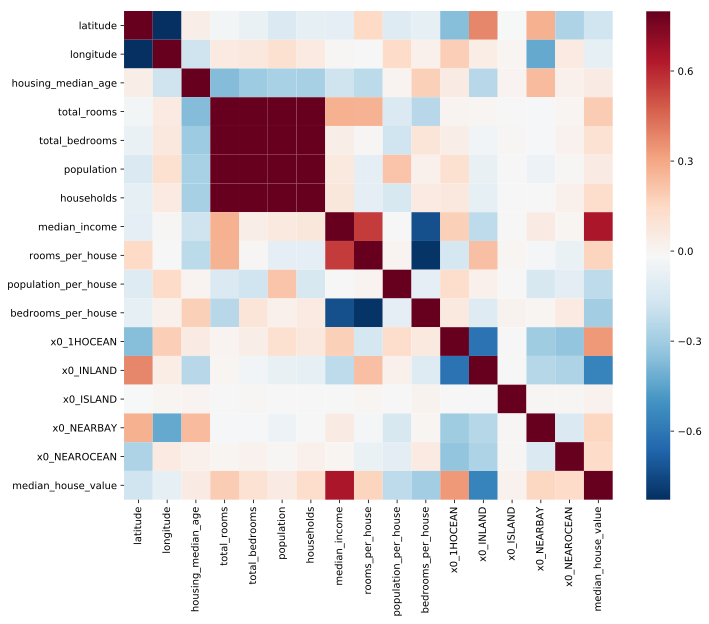


```python
cols = corr_matrix.nlargest(10, target)[target].index
cm = np.corrcoef(preprocessed[cols].values.T)
sns.set(font_scale=1.25)
hm = sns.heatmap(cm, cbar=True, annot=True, square=True, fmt='.2f', annot_kws={'size': 10}, yticklabels=cols.values, xticklabels=cols.values, cmap="RdBu_r")
plt.show()
```


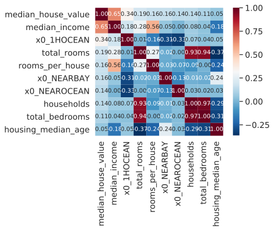


Candidates to drop: total_bedrooms, population (to be confirmed with Feature importance of a Randon Forest regressor)


```python
from PairPlot import hist_plots

hist_plots(preprocessed)
```


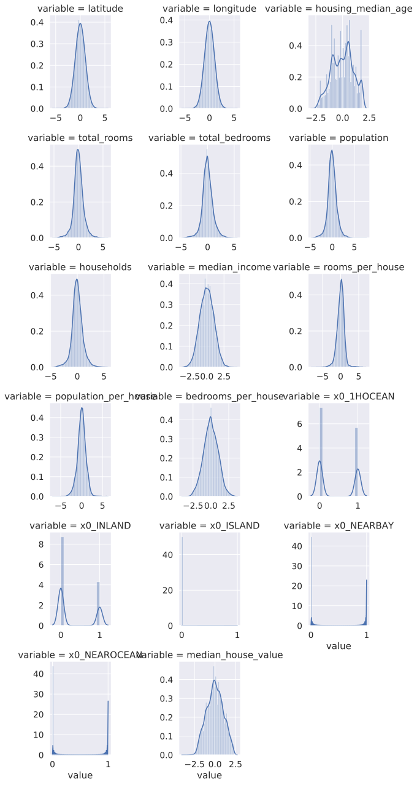


```python
X_preprocessed_np
```


    array([[ 0.83882527, -1.22282726,  1.782406  , ...,  0.        ,
             1.        ,  0.        ],
           [ 2.22455957, -1.34890658, -1.06678776, ...,  0.        ,
             0.        ,  0.        ],
           [-0.49335134,  0.29638362,  1.42946168, ...,  0.        ,
             0.        ,  0.        ],
           ...,
           [-0.0400562 ,  0.00601392, -0.1466667 , ...,  0.        ,
             0.        ,  0.        ],
           [-0.89929069,  0.79533613, -0.22674992, ...,  0.        ,
             0.        ,  0.        ],
           [ 0.24325444, -0.63641365,  0.47501809, ...,  0.        ,
             0.        ,  0.        ]])


# Define regression pipelines

## Train a linear regression pipe


```python
from sklearn.linear_model import LinearRegression

lm_pipe = Pipeline(steps=[
    ('preprocess', preprocessing_pipe),
    ('reg', LinearRegression())
])

lm_pipe.fit(X_train_raw, y_train)
```


    Pipeline(memory=None,
         steps=[('preprocess', ColumnTransformer(n_jobs=None, remainder='drop', sparse_threshold=0.3,
             transformer_weights=None,
             transformers=[('numeric', Pipeline(memory=None,
         steps=[('extend_features', ExtendFeatures()), ('quantile_mapper', DataFrameMapper(default=None, df_out=True,
     ..., ('reg', LinearRegression(copy_X=True, fit_intercept=True, n_jobs=None,
             normalize=False))])


### Define function to predict and score regression models


```python
from sklearn.metrics import mean_squared_error, explained_variance_score

def predict_and_score(model):
    # predict, uses inverse transform of y pipe
    test_predictions = model.predict(X_test_raw)
    test_predictions = y_pipe.inverse_transform(test_predictions.reshape(-1, 1))  
    # scores
    rmse_test = np.sqrt(mean_squared_error(test_predictions, y_test_raw))
    mape_test = np.mean(np.abs(y_test_raw.values - test_predictions) / y_test_raw.values) * 100
    print(f'Test RMSE: {rmse_test:.0f}')
    print(f'Test MAPE:  {mape_test:.2f}%')
    print(f'Explained variance: {explained_variance_score(y_test_raw, test_predictions) * 100:.2f}%')
```


```python
predict_and_score(lm_pipe)
```

    Test RMSE: 58210
    Test MAPE:  24.55%
    Explained variance: 63.90%


## Train a Ridge and Lasso regression using Polynomial a feature adder

### Define a polynomial feature adder and modify the preprocessing pipe


```python
from sklearn_pandas import DataFrameMapper, gen_features
from sklearn.preprocessing import PolynomialFeatures

cols_to_poly = ['median_income', 'rooms_per_house', 'housing_median_age', 'population_per_house']

transformers = [{'class': PolynomialFeatures, 'degree': 4, 'include_bias': False}]
col_trans = gen_features([[col] for col in cols_to_poly], transformers)

poly_adder = DataFrameMapper(col_trans, df_out=True, default=None)
```


```python
# Define numerical_poly pipeline
num_poly_preprocess = Pipeline(steps=[
    ('extend_features', ExtendFeatures()),
    ('poly_adder', poly_adder),
    ('quantile_mapper', quantile_mapper),
    ('imputer', SimpleImputer(strategy='median')),
    ('scaler', PowerTransformer())
])

poly_preprocessing_pipe = ColumnTransformer(transformers=[
    ('poly_numeric', num_poly_preprocess, num_cols),
    ('categorical', cat_preprocess, cat_cols)
])
```

### Create a Ridge pipe


```python
from sklearn.linear_model import Ridge

ridge_pipe = Pipeline(steps=[
    ('poly_preprocess', poly_preprocessing_pipe),
    ('reg', Ridge(alpha=0.1, solver='cholesky'))
])

ridge_pipe.fit(X_train_raw, y_train)
```


    Pipeline(memory=None,
         steps=[('poly_preprocess', ColumnTransformer(n_jobs=None, remainder='drop', sparse_threshold=0.3,
             transformer_weights=None,
             transformers=[('poly_numeric', Pipeline(memory=None,
         steps=[('extend_features', ExtendFeatures()), ('poly_adder', DataFrameMapper(default=None, df_out=Tr...ntercept=True, max_iter=None,
       normalize=False, random_state=None, solver='cholesky', tol=0.001))])


```python
predict_and_score(ridge_pipe)
```

    Test RMSE: 57939
    Test MAPE:  24.23%
    Explained variance: 64.23%


### Create a Lasso pipe


```python
from sklearn.linear_model import Lasso

lasso_pipe = Pipeline(steps=[
    ('poly_preprocess', poly_preprocessing_pipe),
    ('reg', Lasso(alpha=0.1, max_iter=100000))
])

lasso_pipe.fit(X_train_raw, y_train)
```


    Pipeline(memory=None,
         steps=[('poly_preprocess', ColumnTransformer(n_jobs=None, remainder='drop', sparse_threshold=0.3,
             transformer_weights=None,
             transformers=[('poly_numeric', Pipeline(memory=None,
         steps=[('extend_features', ExtendFeatures()), ('poly_adder', DataFrameMapper(default=None, df_out=Tr...e=False, precompute=False, random_state=None,
       selection='cyclic', tol=0.0001, warm_start=False))])


```python
predict_and_score(lasso_pipe)
```

    Test RMSE: 65244
    Test MAPE:  28.14%
    Explained variance: 55.38%


### Create an ElasticNet pipe


```python
from sklearn.linear_model import ElasticNet

elastic_net_pipe = Pipeline(steps=[
    ('poly_preprocess', poly_preprocessing_pipe),
    ('reg', ElasticNet(alpha=0.1, l1_ratio=0.5, max_iter=1_000_000))
])

elastic_net_pipe.fit(X_train_raw, y_train)
```


    Pipeline(memory=None,
         steps=[('poly_preprocess', ColumnTransformer(n_jobs=None, remainder='drop', sparse_threshold=0.3,
             transformer_weights=None,
             transformers=[('poly_numeric', Pipeline(memory=None,
         steps=[('extend_features', ExtendFeatures()), ('poly_adder', DataFrameMapper(default=None, df_out=Tr...alse, precompute=False,
          random_state=None, selection='cyclic', tol=0.0001, warm_start=False))])


```python
predict_and_score(elastic_net_pipe)
```

    Test RMSE: 62268
    Test MAPE:  26.68%
    Explained variance: 59.21%


## Random Forest regressor pipe


```python
from sklearn.ensemble import RandomForestRegressor


rf_pipe = Pipeline(steps=[
    ('preprocess', preprocessing_pipe),
    ('reg', RandomForestRegressor(n_estimators=100))
])
```


```python
rf_pipe.fit(X_train_raw, y_train.flat)
```


    Pipeline(memory=None,
         steps=[('preprocess', ColumnTransformer(n_jobs=None, remainder='drop', sparse_threshold=0.3,
             transformer_weights=None,
             transformers=[('numeric', Pipeline(memory=None,
         steps=[('extend_features', ExtendFeatures()), ('quantile_mapper', DataFrameMapper(default=None, df_out=True,
     ...tors=100, n_jobs=None,
               oob_score=False, random_state=None, verbose=0, warm_start=False))])


```python
predict_and_score(rf_pipe)
```

    Test RMSE: 44066
    Test MAPE:  16.65%
    Explained variance: 79.19%


### Make a grid search to tune the hyperparameters of the RF pipe


```python
from sklearn.model_selection import RandomizedSearchCV

param_grid = {
    'reg__bootstrap': [False],
    'reg__max_depth': [None] + [x for x in range(1, 10, 1)],
    'reg__max_features': ['sqrt'],
    'reg__min_samples_leaf': [1, 2, 4],
    'reg__min_samples_split': [2, 5, 10],
    'reg__n_estimators': range(10, 1000, 50)
}

rf_grid_search = RandomizedSearchCV(rf_pipe, param_distributions=param_grid, cv=3, 
                                    scoring='neg_mean_squared_error', n_iter = 20, 
                                    verbose=1, random_state=42, n_jobs=-1)
rf_grid_search.fit(X_train_raw, y_train.ravel())
```

    Fitting 3 folds for each of 20 candidates, totalling 60 fits


    [Parallel(n_jobs=-1)]: Using backend LokyBackend with 12 concurrent workers.
    [Parallel(n_jobs=-1)]: Done  26 tasks      | elapsed:   27.5s
    [Parallel(n_jobs=-1)]: Done  60 out of  60 | elapsed:  1.1min finished


    RandomizedSearchCV(cv=3, error_score='raise-deprecating',
              estimator=Pipeline(memory=None,
         steps=[('preprocess', ColumnTransformer(n_jobs=None, remainder='drop', sparse_threshold=0.3,
             transformer_weights=None,
             transformers=[('numeric', Pipeline(memory=None,
         steps=[('extend_features', ExtendFeatures()), ('quantile_mapper', DataFrameMapper(default=None, df_out=True,
     ...tors=100, n_jobs=None,
               oob_score=False, random_state=None, verbose=0, warm_start=False))]),
              fit_params=None, iid='warn', n_iter=20, n_jobs=-1,
              param_distributions={'reg__bootstrap': [False], 'reg__max_depth': [None, 1, 2, 3, 4, 5, 6, 7, 8, 9], 'reg__max_features': ['sqrt'], 'reg__min_samples_leaf': [1, 2, 4], 'reg__min_samples_split': [2, 5, 10], 'reg__n_estimators': range(10, 1000, 50)},
              pre_dispatch='2*n_jobs', random_state=42, refit=True,
              return_train_score='warn', scoring='neg_mean_squared_error',
              verbose=1)


```python
predict_and_score(rf_grid_search)
```

    Test RMSE: 43759
    Test MAPE:  16.50%
    Explained variance: 79.60%


Set parameters found into rf_pipe:


```python
rf_grid_search.best_params_
```


    {'reg__n_estimators': 510,
     'reg__min_samples_split': 2,
     'reg__min_samples_leaf': 2,
     'reg__max_features': 'sqrt',
     'reg__max_depth': None,
     'reg__bootstrap': False}


```python
rf_pipe.set_params(**rf_grid_search.best_params_)
```


    Pipeline(memory=None,
         steps=[('preprocess', ColumnTransformer(n_jobs=None, remainder='drop', sparse_threshold=0.3,
             transformer_weights=None,
             transformers=[('numeric', Pipeline(memory=None,
         steps=[('extend_features', ExtendFeatures()), ('quantile_mapper', DataFrameMapper(default=None, df_out=True,
     ...tors=510, n_jobs=None,
               oob_score=False, random_state=None, verbose=0, warm_start=False))])


Test that the parameters were correctly set in the pipe:


```python
rf_pipe.fit(X_train_raw, y_train.ravel())
predict_and_score(rf_pipe)
```

    Test RMSE: 43676
    Test MAPE:  16.52%
    Explained variance: 79.67%


Which is quite similar to the result found using gridsearch (small differences due to the CV procedure that gridsearch does).

## Principal components analysis


```python
from sklearn.decomposition import PCA

n_components = 7
pca = PCA(n_components)
x_pca = pca.fit_transform(preprocessed.drop(target, axis=1))
print('Explained variance: \n', pca.explained_variance_ratio_)  # [0.84, 0.14]
cumsum = np.cumsum(pca.explained_variance_ratio_)   # plot cumsum
print('\nCumulative explained variance: \n', cumsum)
d = np.argmax(cumsum >= 0.95) + 1
```

    Explained variance: 
     [0.34013303 0.21667788 0.16410612 0.09090704 0.07756537 0.0478922
     0.01993431]
    
    Cumulative explained variance: 
     [0.34013303 0.55681091 0.72091703 0.81182407 0.88938944 0.93728164
     0.95721595]


```python
plt.plot(cumsum)
plt.title('Explained variance per # of principal components')
```


    Text(0.5, 1.0, 'Explained variance per # of principal components')


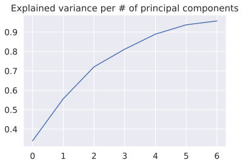


```python
plt.figure(figsize=(12,12))
sns.heatmap(pca.components_.T,
            yticklabels=preprocessed.drop(target,axis=1).columns,
            xticklabels=[str(i) for i in range(n_components)],
            cmap="RdBu_r", square=True)
plt.ylabel('Features')
plt.xlabel('Principal components')
plt.title('Relation matrix for each feature')
plt.show()
```


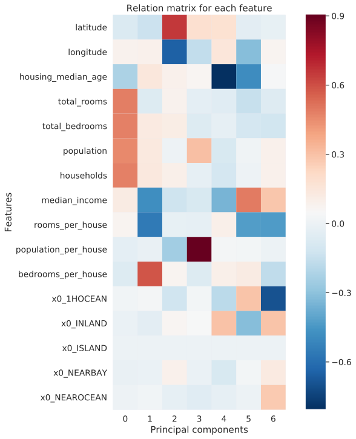


## Using PCA inside the regression pipe, gridsearch


```python
from sklearn.ensemble import RandomForestRegressor


rf_pca_pipe = Pipeline(steps=[
    ('preprocess', preprocessing_pipe),
    ('pca', PCA(n_components=7)),
    ('reg', RandomForestRegressor(n_jobs=-1))
])
```


```python
from sklearn.model_selection import RandomizedSearchCV

param_grid = {
    'reg__bootstrap': [False],
    'reg__max_depth': [None] + [x for x in range(1, 10, 2)],
    'reg__max_features': ['sqrt'],
    'reg__min_samples_leaf': [1, 2, 4],
    'reg__min_samples_split': [2, 5, 10],
    'reg__n_estimators': range(10, 1000, 100)
}

rf_pca_grid_search = RandomizedSearchCV(rf_pca_pipe, param_distributions=param_grid, cv=3, 
                                        scoring='neg_mean_squared_error', n_iter = 20, 
                                        verbose=1, random_state=42, n_jobs=-1)
rf_pca_grid_search.fit(X_train_raw, y_train.ravel())
```

    Fitting 3 folds for each of 20 candidates, totalling 60 fits


    [Parallel(n_jobs=-1)]: Using backend LokyBackend with 12 concurrent workers.
    [Parallel(n_jobs=-1)]: Done  26 tasks      | elapsed:   46.5s
    [Parallel(n_jobs=-1)]: Done  60 out of  60 | elapsed:  1.4min finished


    RandomizedSearchCV(cv=3, error_score='raise-deprecating',
              estimator=Pipeline(memory=None,
         steps=[('preprocess', ColumnTransformer(n_jobs=None, remainder='drop', sparse_threshold=0.3,
             transformer_weights=None,
             transformers=[('numeric', Pipeline(memory=None,
         steps=[('extend_features', ExtendFeatures()), ('quantile_mapper', DataFrameMapper(default=None, df_out=True,
     ...ors='warn', n_jobs=-1,
               oob_score=False, random_state=None, verbose=0, warm_start=False))]),
              fit_params=None, iid='warn', n_iter=20, n_jobs=-1,
              param_distributions={'reg__bootstrap': [False], 'reg__max_depth': [None, 1, 3, 5, 7, 9], 'reg__max_features': ['sqrt'], 'reg__min_samples_leaf': [1, 2, 4], 'reg__min_samples_split': [2, 5, 10], 'reg__n_estimators': range(10, 1000, 100)},
              pre_dispatch='2*n_jobs', random_state=42, refit=True,
              return_train_score='warn', scoring='neg_mean_squared_error',
              verbose=1)


```python
predict_and_score(rf_pca_grid_search)
```

    Test RMSE: 51812
    Test MAPE:  20.58%
    Explained variance: 71.54%


Using PCA gives worst results. Testing now with Poly adder before the PCA:

### Using poly features, PCA in a gridsearch


```python
rf_poly_pca_pipe = Pipeline(steps=[
    ('poly_preprocess', poly_preprocessing_pipe),
    ('pca', PCA(n_components=7)),
    ('reg', RandomForestRegressor(n_jobs=-1))
])

rf_poly_pca_grid_search = RandomizedSearchCV(rf_poly_pca_pipe, param_distributions=param_grid, cv=3,
                                            scoring='neg_mean_squared_error', n_iter=20,
                                            verbose=1, random_state=42, n_jobs=-1)
rf_poly_pca_grid_search.fit(X_train_raw, y_train.ravel())
```

    Fitting 3 folds for each of 20 candidates, totalling 60 fits


    [Parallel(n_jobs=-1)]: Using backend LokyBackend with 12 concurrent workers.
    [Parallel(n_jobs=-1)]: Done  26 tasks      | elapsed:   48.5s
    [Parallel(n_jobs=-1)]: Done  60 out of  60 | elapsed:  1.5min finished


    RandomizedSearchCV(cv=3, error_score='raise-deprecating',
              estimator=Pipeline(memory=None,
         steps=[('poly_preprocess', ColumnTransformer(n_jobs=None, remainder='drop', sparse_threshold=0.3,
             transformer_weights=None,
             transformers=[('poly_numeric', Pipeline(memory=None,
         steps=[('extend_features', ExtendFeatures()), ('poly_adder', DataFrameMapper(default=None, df_out=Tr...ors='warn', n_jobs=-1,
               oob_score=False, random_state=None, verbose=0, warm_start=False))]),
              fit_params=None, iid='warn', n_iter=20, n_jobs=-1,
              param_distributions={'reg__bootstrap': [False], 'reg__max_depth': [None, 1, 3, 5, 7, 9], 'reg__max_features': ['sqrt'], 'reg__min_samples_leaf': [1, 2, 4], 'reg__min_samples_split': [2, 5, 10], 'reg__n_estimators': range(10, 1000, 100)},
              pre_dispatch='2*n_jobs', random_state=42, refit=True,
              return_train_score='warn', scoring='neg_mean_squared_error',
              verbose=1)


```python
predict_and_score(rf_poly_pca_grid_search)
```

    Test RMSE: 52087
    Test MAPE:  20.71%
    Explained variance: 71.21%


Set found parameters into rf_poly_pca_pipe:


```python
rf_poly_pca_pipe.set_params(**rf_poly_pca_grid_search.best_params_)
rf_poly_pca_pipe.fit(X_train_raw, y_train.ravel())
predict_and_score(rf_poly_pca_pipe)
```

    Test RMSE: 52103
    Test MAPE:  20.68%
    Explained variance: 71.18%


## Training a Deep Neural Network


```python
from tensorflow.keras import models, layers, regularizers, optimizers
from tensorflow.keras.wrappers.scikit_learn import KerasRegressor

def make_model():
    network = models.Sequential()
    network.add(layers.Dense(128, activation='relu', input_shape=(16,), kernel_regularizer=regularizers.l2(0.0001)))
    network.add(layers.Dense(128, activation='relu', kernel_regularizer=regularizers.l2(0.0001)))
    network.add(layers.Dense(64, activation='relu', kernel_regularizer=regularizers.l2(0.0001)))
    network.add(layers.Dense(1))  # last layer: linear, no activation: the network is free to learn to predict values in any range
    network.compile(optimizer=optimizers.RMSprop(lr=0.001), loss='mse')
    return network


neural_network = KerasRegressor(make_model, epochs=10)
```


```python
nn_pipe = Pipeline(steps=[
    ('preprocess', preprocessing_pipe),
    ('nn', neural_network)
])

nn_pipe.fit(X_train_raw, y_train)
```

    Train on 15740 samples
    Epoch 1/10
    15740/15740 [==============================] - 1s 58us/sample - loss: 0.3133
    Epoch 2/10
    15740/15740 [==============================] - 1s 59us/sample - loss: 0.2666
    Epoch 3/10
    15740/15740 [==============================] - 1s 61us/sample - loss: 0.2482
    Epoch 4/10
    15740/15740 [==============================] - 1s 54us/sample - loss: 0.2360
    Epoch 5/10
    15740/15740 [==============================] - 1s 63us/sample - loss: 0.2255
    Epoch 6/10
    15740/15740 [==============================] - 1s 61us/sample - loss: 0.2197
    Epoch 7/10
    15740/15740 [==============================] - 1s 57us/sample - loss: 0.2147
    Epoch 8/10
    15740/15740 [==============================] - 1s 66us/sample - loss: 0.2111
    Epoch 9/10
    15740/15740 [==============================] - 1s 60us/sample - loss: 0.2065
    Epoch 10/10
    15740/15740 [==============================] - 1s 59us/sample - loss: 0.2027


    Pipeline(memory=None,
         steps=[('preprocess', ColumnTransformer(n_jobs=None, remainder='drop', sparse_threshold=0.3,
             transformer_weights=None,
             transformers=[('numeric', Pipeline(memory=None,
         steps=[('extend_features', ExtendFeatures()), ('quantile_mapper', DataFrameMapper(default=None, df_out=True,
     ...)), ('nn', <tensorflow.python.keras.wrappers.scikit_learn.KerasRegressor object at 0x7fb8e2353dd8>)])


```python
predict_and_score(nn_pipe)
```

    Test RMSE: 47258
    Test MAPE:  18.59%
    Explained variance: 75.98%


```python
nn_pipe.get_params()
```


    {'memory': None,
     'steps': [('preprocess',
       ColumnTransformer(n_jobs=None, remainder='drop', sparse_threshold=0.3,
                transformer_weights=None,
                transformers=[('numeric', Pipeline(memory=None,
            steps=[('extend_features', ExtendFeatures()), ('quantile_mapper', DataFrameMapper(default=None, df_out=True,
               features=[(['latitude'], QuantileTransformer(copy=True, ignore_implicit_zeros=False, n_quantiles=1000,
                 output_distributi...unknown='error',
              n_values=None, sparse=True))]), Index(['ocean_proximity'], dtype='object'))])),
      ('nn',
       <tensorflow.python.keras.wrappers.scikit_learn.KerasRegressor at 0x7fb8e2353dd8>)],
     'preprocess': ColumnTransformer(n_jobs=None, remainder='drop', sparse_threshold=0.3,
              transformer_weights=None,
              transformers=[('numeric', Pipeline(memory=None,
          steps=[('extend_features', ExtendFeatures()), ('quantile_mapper', DataFrameMapper(default=None, df_out=True,
             features=[(['latitude'], QuantileTransformer(copy=True, ignore_implicit_zeros=False, n_quantiles=1000,
               output_distributi...unknown='error',
            n_values=None, sparse=True))]), Index(['ocean_proximity'], dtype='object'))]),
     'nn': <tensorflow.python.keras.wrappers.scikit_learn.KerasRegressor at 0x7fb8e2353dd8>,
     'preprocess__n_jobs': None,
     'preprocess__remainder': 'drop',
     'preprocess__sparse_threshold': 0.3,
     'preprocess__transformer_weights': None,
     'preprocess__transformers': [('numeric', Pipeline(memory=None,
            steps=[('extend_features', ExtendFeatures()), ('quantile_mapper', DataFrameMapper(default=None, df_out=True,
               features=[(['latitude'], QuantileTransformer(copy=True, ignore_implicit_zeros=False, n_quantiles=1000,
                 output_distribution='normal', random_state=None,
                 subsample=1...dian', verbose=0)), ('scaler', PowerTransformer(copy=True, method='yeo-johnson', standardize=True))]), Index(['longitude', 'latitude', 'housing_median_age', 'total_rooms',
              'total_bedrooms', 'population', 'households', 'median_income'],
             dtype='object')),
      ('categorical', Pipeline(memory=None,
            steps=[('imputer', SimpleImputer(copy=True, fill_value=None, missing_values=nan,
              strategy='most_frequent', verbose=0)), ('encoder', OneHotEncoder(categorical_features=None, categories=None,
              dtype=<class 'numpy.float64'>, handle_unknown='error',
              n_values=None, sparse=True))]), Index(['ocean_proximity'], dtype='object'))],
     'preprocess__numeric': Pipeline(memory=None,
          steps=[('extend_features', ExtendFeatures()), ('quantile_mapper', DataFrameMapper(default=None, df_out=True,
             features=[(['latitude'], QuantileTransformer(copy=True, ignore_implicit_zeros=False, n_quantiles=1000,
               output_distribution='normal', random_state=None,
               subsample=1...dian', verbose=0)), ('scaler', PowerTransformer(copy=True, method='yeo-johnson', standardize=True))]),
     'preprocess__categorical': Pipeline(memory=None,
          steps=[('imputer', SimpleImputer(copy=True, fill_value=None, missing_values=nan,
            strategy='most_frequent', verbose=0)), ('encoder', OneHotEncoder(categorical_features=None, categories=None,
            dtype=<class 'numpy.float64'>, handle_unknown='error',
            n_values=None, sparse=True))]),
     'preprocess__numeric__memory': None,
     'preprocess__numeric__steps': [('extend_features', ExtendFeatures()),
      ('quantile_mapper', DataFrameMapper(default=None, df_out=True,
               features=[(['latitude'], QuantileTransformer(copy=True, ignore_implicit_zeros=False, n_quantiles=1000,
                 output_distribution='normal', random_state=None,
                 subsample=100000)), (['longitude'], QuantileTransformer(copy=True, ignore_implicit_zeros=False, n_quantiles=1000,
                 output_distribution='normal', random_state=None,
                 subsample=100000))],
               input_df=False, sparse=False)),
      ('imputer', SimpleImputer(copy=True, fill_value=None, missing_values=nan,
              strategy='median', verbose=0)),
      ('scaler',
       PowerTransformer(copy=True, method='yeo-johnson', standardize=True))],
     'preprocess__numeric__extend_features': ExtendFeatures(),
     'preprocess__numeric__quantile_mapper': DataFrameMapper(default=None, df_out=True,
             features=[(['latitude'], QuantileTransformer(copy=True, ignore_implicit_zeros=False, n_quantiles=1000,
               output_distribution='normal', random_state=None,
               subsample=100000)), (['longitude'], QuantileTransformer(copy=True, ignore_implicit_zeros=False, n_quantiles=1000,
               output_distribution='normal', random_state=None,
               subsample=100000))],
             input_df=False, sparse=False),
     'preprocess__numeric__imputer': SimpleImputer(copy=True, fill_value=None, missing_values=nan,
            strategy='median', verbose=0),
     'preprocess__numeric__scaler': PowerTransformer(copy=True, method='yeo-johnson', standardize=True),
     'preprocess__numeric__quantile_mapper__default': None,
     'preprocess__numeric__quantile_mapper__df_out': True,
     'preprocess__numeric__quantile_mapper__features': [(['latitude'],
       QuantileTransformer(copy=True, ignore_implicit_zeros=False, n_quantiles=1000,
                 output_distribution='normal', random_state=None,
                 subsample=100000)),
      (['longitude'],
       QuantileTransformer(copy=True, ignore_implicit_zeros=False, n_quantiles=1000,
                 output_distribution='normal', random_state=None,
                 subsample=100000))],
     'preprocess__numeric__quantile_mapper__input_df': False,
     'preprocess__numeric__quantile_mapper__sparse': False,
     'preprocess__numeric__imputer__copy': True,
     'preprocess__numeric__imputer__fill_value': None,
     'preprocess__numeric__imputer__missing_values': nan,
     'preprocess__numeric__imputer__strategy': 'median',
     'preprocess__numeric__imputer__verbose': 0,
     'preprocess__numeric__scaler__copy': True,
     'preprocess__numeric__scaler__method': 'yeo-johnson',
     'preprocess__numeric__scaler__standardize': True,
     'preprocess__categorical__memory': None,
     'preprocess__categorical__steps': [('imputer',
       SimpleImputer(copy=True, fill_value=None, missing_values=nan,
              strategy='most_frequent', verbose=0)),
      ('encoder', OneHotEncoder(categorical_features=None, categories=None,
              dtype=<class 'numpy.float64'>, handle_unknown='error',
              n_values=None, sparse=True))],
     'preprocess__categorical__imputer': SimpleImputer(copy=True, fill_value=None, missing_values=nan,
            strategy='most_frequent', verbose=0),
     'preprocess__categorical__encoder': OneHotEncoder(categorical_features=None, categories=None,
            dtype=<class 'numpy.float64'>, handle_unknown='error',
            n_values=None, sparse=True),
     'preprocess__categorical__imputer__copy': True,
     'preprocess__categorical__imputer__fill_value': None,
     'preprocess__categorical__imputer__missing_values': nan,
     'preprocess__categorical__imputer__strategy': 'most_frequent',
     'preprocess__categorical__imputer__verbose': 0,
     'preprocess__categorical__encoder__categorical_features': None,
     'preprocess__categorical__encoder__categories': None,
     'preprocess__categorical__encoder__dtype': numpy.float64,
     'preprocess__categorical__encoder__handle_unknown': 'error',
     'preprocess__categorical__encoder__n_values': None,
     'preprocess__categorical__encoder__sparse': True,
     'nn__epochs': 10,
     'nn__build_fn': <function __main__.make_model()>}


### Neural network: Validation curve


```python
from sklearn.model_selection import validation_curve

param_range = range(5, 51, 5)

train_scores, test_scores = validation_curve(nn_pipe, X_train_raw, y_train, 
                                             'nn__epochs', param_range, cv=3, n_jobs=-1)
```


```python
train_scores_mean = np.mean(train_scores, axis=1)
train_scores_std = np.std(train_scores, axis=1)
test_scores_mean = np.mean(test_scores, axis=1)
test_scores_std = np.std(test_scores, axis=1)

plt.title("Validation Curve - Neural network pipe")
plt.xlabel("Epochs")
plt.ylabel("Score")
# plt.ylim(0.0, 1.1)
lw = 2
plt.plot(param_range, train_scores_mean, label="Training score", color="darkorange", lw=lw)
plt.fill_between(param_range, train_scores_mean - train_scores_std,
                 train_scores_mean + train_scores_std, alpha=0.2,
                 color="darkorange", lw=lw)
plt.plot(param_range, test_scores_mean, label="Cross-validation score", color="navy", lw=lw)
plt.fill_between(param_range, test_scores_mean - test_scores_std,
                 test_scores_mean + test_scores_std, alpha=0.2,
                 color="navy", lw=lw)
plt.legend(loc="best")
plt.show()

```


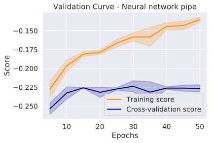


```python
nn_pipe.set_params(nn__epochs=40)
nn_pipe.fit(X_train_raw, y_train)
```

    Train on 15740 samples
    Epoch 1/40
    15740/15740 [==============================] - 1s 67us/sample - loss: 0.3184
    Epoch 2/40
    15740/15740 [==============================] - 1s 59us/sample - loss: 0.2661
    Epoch 3/40
    15740/15740 [==============================] - 1s 68us/sample - loss: 0.2488
    Epoch 4/40
    15740/15740 [==============================] - 1s 58us/sample - loss: 0.2360
    Epoch 5/40
    15740/15740 [==============================] - 1s 42us/sample - loss: 0.2259
    Epoch 6/40
    15740/15740 [==============================] - 0s 24us/sample - loss: 0.2213
    Epoch 7/40
    15740/15740 [==============================] - 0s 24us/sample - loss: 0.2157
    Epoch 8/40
    15740/15740 [==============================] - 0s 25us/sample - loss: 0.2115
    Epoch 9/40
    15740/15740 [==============================] - 0s 25us/sample - loss: 0.2059
    Epoch 10/40
    15740/15740 [==============================] - 0s 24us/sample - loss: 0.2013
    Epoch 11/40
    15740/15740 [==============================] - 0s 24us/sample - loss: 0.1990
    Epoch 12/40
    15740/15740 [==============================] - 0s 24us/sample - loss: 0.1946
    Epoch 13/40
    15740/15740 [==============================] - 1s 55us/sample - loss: 0.1927
    Epoch 14/40
    15740/15740 [==============================] - 1s 67us/sample - loss: 0.1893
    Epoch 15/40
    15740/15740 [==============================] - 1s 84us/sample - loss: 0.1865
    Epoch 16/40
    15740/15740 [==============================] - 1s 71us/sample - loss: 0.1852
    Epoch 17/40
    15740/15740 [==============================] - 1s 86us/sample - loss: 0.1828
    Epoch 18/40
    15740/15740 [==============================] - 1s 37us/sample - loss: 0.1815
    Epoch 19/40
    15740/15740 [==============================] - 1s 76us/sample - loss: 0.1778
    Epoch 20/40
    15740/15740 [==============================] - 0s 26us/sample - loss: 0.1779
    Epoch 21/40
    15740/15740 [==============================] - 0s 27us/sample - loss: 0.1759
    Epoch 22/40
    15740/15740 [==============================] - 0s 26us/sample - loss: 0.1746
    Epoch 23/40
    15740/15740 [==============================] - 1s 42us/sample - loss: 0.1725
    Epoch 24/40
    15740/15740 [==============================] - 1s 67us/sample - loss: 0.1732
    Epoch 25/40
    15740/15740 [==============================] - 1s 54us/sample - loss: 0.1714
    Epoch 26/40
    15740/15740 [==============================] - 1s 60us/sample - loss: 0.1702
    Epoch 27/40
    15740/15740 [==============================] - 1s 50us/sample - loss: 0.1687
    Epoch 28/40
    15740/15740 [==============================] - 1s 67us/sample - loss: 0.1673
    Epoch 29/40
    15740/15740 [==============================] - 1s 64us/sample - loss: 0.1662
    Epoch 30/40
    15740/15740 [==============================] - 1s 77us/sample - loss: 0.1656
    Epoch 31/40
    15740/15740 [==============================] - 1s 67us/sample - loss: 0.1634
    Epoch 32/40
    15740/15740 [==============================] - 1s 63us/sample - loss: 0.1639
    Epoch 33/40
    15740/15740 [==============================] - 1s 72us/sample - loss: 0.1618
    Epoch 34/40
    15740/15740 [==============================] - 0s 31us/sample - loss: 0.1619
    Epoch 35/40
    15740/15740 [==============================] - 0s 31us/sample - loss: 0.1612
    Epoch 36/40
    15740/15740 [==============================] - 1s 54us/sample - loss: 0.1594
    Epoch 37/40
    15740/15740 [==============================] - 0s 27us/sample - loss: 0.1592
    Epoch 38/40
    15740/15740 [==============================] - 0s 30us/sample - loss: 0.1582
    Epoch 39/40
    15740/15740 [==============================] - 1s 61us/sample - loss: 0.1581
    Epoch 40/40
    15740/15740 [==============================] - 1s 48us/sample - loss: 0.1574


    Pipeline(memory=None,
         steps=[('preprocess', ColumnTransformer(n_jobs=None, remainder='drop', sparse_threshold=0.3,
             transformer_weights=None,
             transformers=[('numeric', Pipeline(memory=None,
         steps=[('extend_features', ExtendFeatures()), ('quantile_mapper', DataFrameMapper(default=None, df_out=True,
     ...)), ('nn', <tensorflow.python.keras.wrappers.scikit_learn.KerasRegressor object at 0x7fb8e2353dd8>)])


```python
predict_and_score(nn_pipe)
```

    Test RMSE: 43412
    Test MAPE:  17.41%
    Explained variance: 79.66%


## Train a XGBoost regressor


```python
from xgboost import XGBRegressor

xgb_params = {
    'learning_rate':0.01,
    'n_estimators':6000,
    'max_depth':4,
    'min_child_weight':0,
    'gamma':0.6,
    'subsample':0.7,
    'colsample_bytree':0.7,
    'objective':'reg:squarederror',
    'nthread':-1,
    'scale_pos_weight':1,
    'seed':27,
    'reg_alpha':0.00006,
    'random_state':42
}

xgb_pipe = Pipeline(steps=[
    ('preprocess', preprocessing_pipe),
    ('reg', XGBRegressor(**xgb_params))
])
```


```python
xgb_pipe.fit(X_train_raw, y_train)
```


    Pipeline(memory=None,
         steps=[('preprocess', ColumnTransformer(n_jobs=None, remainder='drop', sparse_threshold=0.3,
             transformer_weights=None,
             transformers=[('numeric', Pipeline(memory=None,
         steps=[('extend_features', ExtendFeatures()), ('quantile_mapper', DataFrameMapper(default=None, df_out=True,
     ...=6e-05, reg_lambda=1, scale_pos_weight=1, seed=27,
           silent=None, subsample=0.7, verbosity=1))])


```python
predict_and_score(xgb_pipe)
```

    Test RMSE: 41311
    Test MAPE:  15.90%
    Explained variance: 81.70%


# Ensemble regressor: stacking the best (less correlated) models

## Model correlations


```python
# Models to use in the stack:
regressors = {'lm': lm_pipe, 
              'ridge': ridge_pipe, 
              'lasso': lasso_pipe, 
              'elastic_net': elastic_net_pipe, 
              'rf': rf_pipe,
              'rf_poly_pca': rf_poly_pca_pipe, 
              'nn': nn_pipe, 
              'xgb': xgb_pipe}
```


```python
def predictions_from_models(X, regressors):
    predictions = np.ndarray((len(X), len(regressors)))
    for idx, regressor in enumerate(regressors.values()):
        predictions[:, idx] = regressor.predict(X).flat
    return pd.DataFrame(predictions, columns=regressors.keys())

predictions = predictions_from_models(X_test_raw, regressors)
```


```python
from mlens.visualization import corrmat

corrmat(predictions.corr())
```

    [MLENS] backend: threading


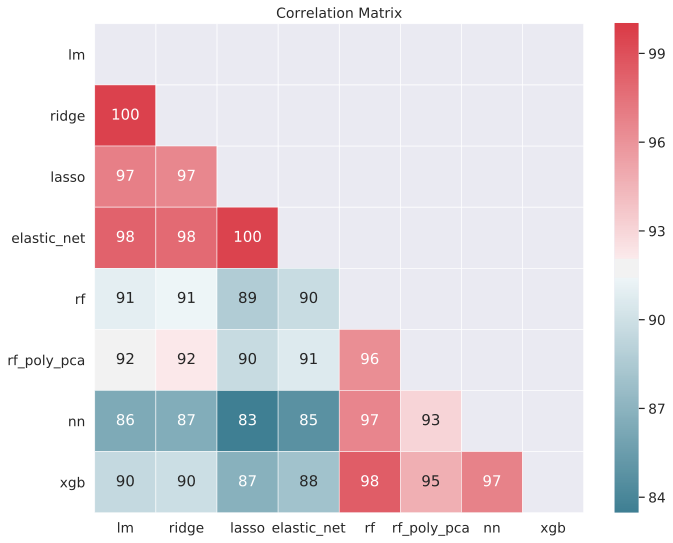


    <matplotlib.axes._subplots.AxesSubplot at 0x7fb8a8268080>


## Ensemble definition


```python
from mlens.ensemble import SuperLearner
from mlens.metrics import rmse

ensemble = SuperLearner(scorer=rmse, random_state=42, verbose=2)

# 1st layer
ensemble.add([regressors[name] for name in ['lm', 'elastic_net', 'rf', 'rf_poly_pca', 'xgb']])

# Attach the final meta estimator
ensemble.add_meta(XGBRegressor(**xgb_params))
```


    SuperLearner(array_check=None, backend=None, folds=2,
           layers=[Layer(backend='threading', dtype=<class 'numpy.float32'>, n_jobs=-1,
       name='layer-1', propagate_features=None, raise_on_exception=True,
       random_state=7270, shuffle=False,
       stack=[Group(backend='threading', dtype=<class 'numpy.float32'>,
       indexer=FoldIndex(X=None, folds=2, raise_on_ex...810da60>)],
       n_jobs=-1, name='group-3', raise_on_exception=True, transformers=[])],
       verbose=1)],
           model_selection=False, n_jobs=None, raise_on_exception=True,
           random_state=42, sample_size=20,
           scorer=<function rmse at 0x7fb8a810da60>, shuffle=False, verbose=2)


```python
# Fit ensemble
ensemble.fit(X_train_raw, y_train.ravel())

# Predict
predictions = ensemble.predict(X_test_raw)
```

    
    Fitting 2 layers
    Processing layer-1             

    /home/diego/miniconda3/lib/python3.6/site-packages/sklearn/ensemble/base.py:154: UserWarning: Loky-backed parallel loops cannot be nested below threads, setting n_jobs=1
      n_jobs = min(effective_n_jobs(n_jobs), n_estimators)
    /home/diego/miniconda3/lib/python3.6/site-packages/sklearn/ensemble/base.py:154: UserWarning: Loky-backed parallel loops cannot be nested below threads, setting n_jobs=1
      n_jobs = min(effective_n_jobs(n_jobs), n_estimators)


    done | 00:01:12
    Processing layer-2             done | 00:00:44
    Fit complete                        | 00:01:57
    
    Predicting 2 layers
    Processing layer-1             

    /home/diego/miniconda3/lib/python3.6/site-packages/sklearn/ensemble/base.py:154: UserWarning: Loky-backed parallel loops cannot be nested below threads, setting n_jobs=1
      n_jobs = min(effective_n_jobs(n_jobs), n_estimators)


    done | 00:00:01
    Processing layer-2             done | 00:00:00
    Predict complete                    | 00:00:01


```python
print("Fit data:\n%r" % ensemble.data)
```

    Fit data:
                           score-m  score-s   ft-m  ft-s  pt-m  pt-s
    layer-1  pipeline-1       0.58     0.00   0.92  0.11  0.74  0.01
    layer-1  pipeline-2       0.62     0.00   3.86  0.43  2.23  0.28
    layer-1  pipeline-3       0.44     0.00  36.82  0.08  1.00  0.01
    layer-1  pipeline-4       0.51     0.00  18.83  1.83  4.98  1.61
    layer-1  pipeline-5       0.42     0.00  55.26  0.07  0.58  0.02
    


```python
predict_and_score(ensemble)
```

    
    Predicting 2 layers
    Processing layer-1             

    /home/diego/miniconda3/lib/python3.6/site-packages/sklearn/ensemble/base.py:154: UserWarning: Loky-backed parallel loops cannot be nested below threads, setting n_jobs=1
      n_jobs = min(effective_n_jobs(n_jobs), n_estimators)


    done | 00:00:01
    Processing layer-2             done | 00:00:00
    Predict complete                    | 00:00:01
    Test RMSE: 41162
    Test MAPE:  15.82%
    Explained variance: 81.79%

